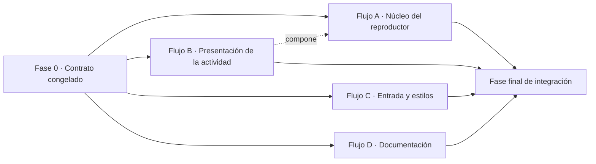

# SPEC 03 — Reproductor de clases (Lesson Player) · Plan paralelo multiagente

> **Estado:** Aprobado
> **Reorganización paralela:** 2026-09-23
> **Plan original:** `specs/03-reproductor-de-clases.md`
> **Depende de:** SPEC 01 — Gestión de clases; SPEC 02 — Editor de actividades (MVP simplificado).
> **Objetivo:** Permitir impartir una clase actividad por actividad, con navegación anterior/siguiente, contador de progreso y una vista de solo lectura preparada para usarse durante una sesión real.
> **Estrategia:** 4 flujos paralelos, 1 fase de contrato y 1 fase final de integración, sobre 6 ramas y 5 worktrees independientes, con 6 puntos de integración explícitos.

---

## 1. Resumen de la paralelización

Esta spec tiene una característica que cambia por completo el reparto: **no hay backend, ni
migraciones, ni instantánea de EF, ni base de datos**. El cuello de botella clásico de este
repositorio —la carpeta `Migrations/` y `AppDbContextModelSnapshot.cs` como recursos de escritor
único— simplemente no existe aquí. Todo el trabajo es frontend y se puede partir en conjuntos de
archivos disjuntos, que es la condición que hace real el paralelismo.

Lo que **no** se puede paralelizar es el Flujo A. El módulo de posición y la pantalla del reproductor
comparten el mismo estado de navegación: partirlos obligaría a que dos agentes se sincronizaran en
cada etapa, y el coste de coordinación superaría el trabajo. El Flujo A concentra 8 de las 10 etapas
del plan original y es el camino crítico.

El ahorro es **moderado y hay que decirlo**: la spec es de una sola área y un solo directorio. El
paralelismo no acorta el camino crítico, solo saca de él todo lo que no le pertenece (la vista de la
actividad, la entrada desde el listado, los estilos y la documentación).

| Indicador                           | Plan original                             | Plan paralelo                                                                                       |
| ----------------------------------- | ----------------------------------------- | --------------------------------------------------------------------------------------------------- |
| Fases                               | 10 secuenciales                           | 1 de contrato + 4 flujos + 1 de integración (6 bloques)                                             |
| Flujos simultáneos máximos          | 1                                         | 4 (A, B, C y D), de los cuales 3 escriben código                                                    |
| Camino crítico                      | 10 etapas                                 | 3 bloques: Fase 0 → Flujo A → Fase final de integración                                             |
| Archivos con escritura compartida   | —                                         | 1, y solo de forma secuencial (`ActivityView.tsx`: stub en la Fase 0, implementación en el Flujo B) |
| Recursos de escritor único clásicos | instantánea de EF y cadena de migraciones | ninguno (no se toca el backend)                                                                     |

**Camino crítico:** `Fase 0 → Flujo A → Fase final de integración`
No se puede acortar porque el Flujo A es el único que produce el reproductor, y la integración
necesita el reproductor para poder verificar los criterios de aceptación.

**Paralelismo real:** cuatro flujos pueden ejecutarse a la vez, pero eso exige **una sesión de agente
por worktree**. Si los cuatro agentes son subagentes de una misma sesión, comparten `cwd` y checkout:
el aislamiento no existe y el plan se degrada a secuencial. Con una sola sesión, ejecutar los flujos
en el orden `B → A → C → D` sobre ramas es la alternativa honesta.

---

## 2. Grafo de dependencias



| Desde       | Hacia       | Tipo        | Tratamiento                                                                                                            |
| ----------- | ----------- | ----------- | ---------------------------------------------------------------------------------------------------------------------- |
| Fase 0      | A, B, C     | `contrato`  | **Congelar** en la Fase 0: URL de la posición, lista de clases CSS, fronteras de módulo y textos literales             |
| B           | A           | `funcional` | **Suave**: A compone el componente de B, pero el stub creado en la Fase 0 permite que A compile y se pruebe sin B      |
| C           | A           | `contrato`  | **Suave**: el enlace del listado y la ruta registrada comparten el literal `/lessons/:id/play`, congelado en la Fase 0 |
| C           | A, B        | `contrato`  | **Suave**: las clases CSS se congelan en la Fase 0; A y B solo las usan, nunca las escriben                            |
| A, B, C, D  | Integración | `archivo`   | **Serializar**: una fusión por rama, con verificación después de cada una                                              |
| Integración | E2E         | `entorno`   | **Planificación**: el E2E necesita la app integrada y el puerto libre; se ejecuta solo en la integración               |
| —           | —           | `esquema`   | **No existe**: la spec no toca migraciones, `AppDbContext.cs` ni la instantánea del modelo                             |

**Aristas convertidas en congelación de contrato:** los cuatro contratos de la Fase 0 (C1 URL, C2
transporte, C3 frontera DOM/CSS, C4 fronteras de módulo) más el contrato de textos literales (C5).
Sin ellos, el Flujo A queda bloqueado por B y C y el plan colapsa a secuencial.

---

## 3. Fase 0 — Contrato congelado

Una sola sesión, corta, antes de repartir nada. No escribe comportamiento: escribe **nombres** y un
stub.

| Contrato                     | Artefacto                                                          | Contenido congelado                                                                                                                                                                                                                                                                                                                                                                                                                                                                                                                                                                                                                                                                                                | Consumidores |
| ---------------------------- | ------------------------------------------------------------------ | ------------------------------------------------------------------------------------------------------------------------------------------------------------------------------------------------------------------------------------------------------------------------------------------------------------------------------------------------------------------------------------------------------------------------------------------------------------------------------------------------------------------------------------------------------------------------------------------------------------------------------------------------------------------------------------------------------------------ | ------------ |
| **C1 · URL de la posición**  | §3 de este plan                                                    | Ruta `/lessons/:id/play`; parámetro `actividad` entero con **base 1**; valor `fin` para la pantalla de cierre; normalización con `replace` (sin historial) cuando el valor es ausente, no numérico, decimal, menor que 1 o mayor que el número de actividades; `push` al navegar con Anterior, Siguiente, flechas o «Repetir la clase»                                                                                                                                                                                                                                                                                                                                                                             | A, C, D, E2E |
| **C2 · Transporte y datos**  | `frontend/src/lessons/lesson-api.ts` (solo lectura)                | Se reutilizan sin cambios `getLesson`, `lessonDetailKey`, `LessonDetails` y `LessonActivityDto`. **Sin endpoints nuevos, sin DTO nuevos, sin escrituras.** Los nombres de campo del servidor son `activities[]`, `order`, `estimatedDuration`, `content`, `type`, `title`, `instructions`                                                                                                                                                                                                                                                                                                                                                                                                                          | A, B, D      |
| **C3 · Frontera DOM/CSS**    | §3 de este plan + `frontend/src/styles.css` (propietario: Flujo C) | Raíz `<section className="card lesson-player">`; clases `lesson-player-header`, `lesson-player-progress`, `lesson-player-tools`, `lesson-player-body`, `lesson-player-controls`, `lesson-player-closing`, `lesson-player-summary`, `lesson-player-empty`, `lesson-player-status`, `player-activity`, `player-activity-instructions`, `player-activity-text`, `player-activity-prompt`, `player-activity-explanation`, `player-activity-list`. Ganchos estables para el E2E: `data-testid` = `lesson-player`, `player-progress`, `player-activity-title`, `player-activity-duration`, `player-instructions`, `player-previous`, `player-next`, `player-closing`, `player-empty`, `player-fullscreen`, `player-edit` | A, B, C, E2E |
| **C4 · Fronteras de módulo** | `frontend/src/lessons/ActivityView.tsx` (**stub**)                 | `export type ActivityViewProps = { activity: LessonActivityDto }` y `export default function ActivityView({ activity }: ActivityViewProps)`. Exportaciones de `player-position.ts`: `type PlayerPosition = { kind: 'activity'; index: number } \| { kind: 'closing' }` y `readPlayerPosition(searchParams: URLSearchParams, activityCount: number): PlayerPosition`. Export por defecto de `LessonPlayerPage.tsx` en `frontend/src/lessons/LessonPlayerPage.tsx`                                                                                                                                                                                                                                                   | A, B         |
| **C5 · Textos literales**    | §3 de este plan                                                    | «Actividad N de M», «Sin duración», «0 min», «Duración incompleta», «Esta clase todavía no tiene actividades.», «La clase no existe o no está disponible.», «Volver a Mis clases», «Repetir la clase», «Anterior», «Siguiente», «Pantalla completa», «Editar»                                                                                                                                                                                                                                                                                                                                                                                                                                                      | A, B, C, E2E |

- **Entregable:** los cinco contratos cerrados, sin ningún nombre sin decidir, y el stub
  `frontend/src/lessons/ActivityView.tsx` en la rama de contrato.
- **Verificación:** `cd frontend && npx tsc -b` en verde con el stub presente; revisión de que ningún
  nombre de C3 aparece escrito de dos formas distintas.
- **Criterio de finalización:** `npx tsc -b` en verde, el stub existe y C1–C5 están cerrados. Si algo
  de esta tabla cambia después de repartir los flujos, rompe tres flujos a la vez: es el único punto
  del plan que no admite revisión tardía.
- **Rama / worktree:** `spec-03-reproductor-de-clases--contract` en `../pf-wt-contract`

---

## 4. Fases y flujos paralelos

### Fase 1 · Flujo A — Núcleo del reproductor

| Campo                                        | Valor                                                                                                                                                                                                                    |
| -------------------------------------------- | ------------------------------------------------------------------------------------------------------------------------------------------------------------------------------------------------------------------------ |
| **Objetivo**                                 | Convertir la URL en la posición actual y renderizar una actividad por pantalla, con navegación, cierre y estados.                                                                                                        |
| **Entregable**                               | `/lessons/:id/play` registrada y funcional contra la API real: carga el detalle, muestra la actividad que indica la URL, navega con botones y flechas, cierra la clase y cubre los estados de carga, error, 404 y vacío. |
| **Archivos que posee (escritura exclusiva)** | `frontend/src/lessons/player-position.ts`, `frontend/src/lessons/player-position.test.ts`, `frontend/src/lessons/LessonPlayerPage.tsx`, `frontend/src/lessons/LessonPlayerPage.test.tsx`, `frontend/src/App.tsx`         |
| **Archivos compartidos (solo lectura)**      | `frontend/src/lessons/lesson-api.ts`, `frontend/src/lessons/lesson-schema.ts`, `frontend/src/lessons/ActivityView.tsx` (el stub de la Fase 0), `frontend/src/styles.css`, `frontend/src/auth.ts`                         |
| **Depende de**                               | Fase 0 (`contrato`)                                                                                                                                                                                                      |
| **Bloquea a**                                | Fase final de integración                                                                                                                                                                                                |
| **Rama**                                     | `spec-03-reproductor-de-clases--player`                                                                                                                                                                                  |
| **Worktree**                                 | `../pf-wt-player`                                                                                                                                                                                                        |
| **Agente sugerido**                          | agente frontend React / TypeScript                                                                                                                                                                                       |
| **Duración relativa**                        | **L** — la más larga del plan; concentra 8 de las 10 etapas originales                                                                                                                                                   |

**Tareas**

| #   | Tarea                                                                                                | Archivos                                            | Verificación                                                                      | Pruebas mínimas                                                                                                     |
| --- | ---------------------------------------------------------------------------------------------------- | --------------------------------------------------- | --------------------------------------------------------------------------------- | ------------------------------------------------------------------------------------------------------------------- |
| 1.1 | Módulo puro de posición: base 1, `fin`, normalización con `replace`                                  | `player-position.ts`                                | `npx vitest run src/lessons/player-position.test.ts`                              | `player-position.test.ts`: sin parámetro, valor válido, `fin`, `0`, negativo, decimal, no numérico y fuera de rango |
| 1.2 | Ruta protegida en `App.tsx` y carga del detalle con la caché existente                               | `App.tsx`, `LessonPlayerPage.tsx`                   | `npx tsc -b`                                                                      | ninguna (queda cubierta por 1.3)                                                                                    |
| 1.3 | Estados: carga, error con reintento, 404 con salida a Mis clases y estado vacío sin controles        | `LessonPlayerPage.tsx`, `LessonPlayerPage.test.tsx` | `npx vitest run src/lessons/LessonPlayerPage.test.tsx`                            | 404 con enlace, error con reintento, vacío sin controles                                                            |
| 1.4 | Cabecera de contexto: título, nivel, «Actividad N de M», título y duración; «Sin duración» y «0 min» | `LessonPlayerPage.tsx`                              | pruebas de los cuatro textos                                                      | `LessonPlayerPage.test.tsx`                                                                                         |
| 1.5 | Navegación Anterior / Siguiente, extremos, flechas del teclado y reinicio del desplazamiento         | `LessonPlayerPage.tsx`                              | pruebas de extremos, de flechas y de foco en `input`/`textarea`/`contenteditable` | `LessonPlayerPage.test.tsx`                                                                                         |
| 1.6 | Sincronización con la URL: `push` al navegar, `replace` al normalizar                                | `LessonPlayerPage.tsx`                              | prueba de historial y de recarga                                                  | `LessonPlayerPage.test.tsx`                                                                                         |
| 1.7 | Pantalla de cierre con resumen y «Repetir la clase»                                                  | `LessonPlayerPage.tsx`                              | prueba del resumen y de «Duración incompleta»                                     | `LessonPlayerPage.test.tsx`                                                                                         |
| 1.8 | Pantalla completa, enlace «Editar» y accesibilidad de los controles                                  | `LessonPlayerPage.tsx`                              | prueba del estado real del botón y del destino del enlace                         | `LessonPlayerPage.test.tsx`                                                                                         |

**Criterios de finalización**

- [ ] `cd frontend && npx tsc -b && npx eslint .` en verde dentro del worktree.
- [ ] `npx vitest run src/lessons/player-position.test.ts src/lessons/LessonPlayerPage.test.tsx` en verde.
- [ ] El código del reproductor no contiene ninguna llamada de escritura: el único transporte usado es `getLesson`.
- [ ] `ActivityView.tsx` y `styles.css` **no** se han modificado.
- [ ] `dotnet build Profefacilisimo.slnx --no-restore` sigue en verde (el backend no se ha tocado).

**Riesgos de conflicto**

| Riesgo                                                   | Mitigación                                                                                                                                       |
| -------------------------------------------------------- | ------------------------------------------------------------------------------------------------------------------------------------------------ |
| `frontend/src/App.tsx`                                   | Único escritor del plan para este archivo; ninguna otra rama lo toca                                                                             |
| `frontend/src/styles.css`                                | Solo lectura para A; las clases se congelan en la Fase 0 (C3)                                                                                    |
| `frontend/src/lessons/ActivityView.tsx`                  | A lo importa desde el stub y no lo edita nunca                                                                                                   |
| Puertos de Vite y Playwright                             | A no ejecuta E2E; el E2E se serializa en la fase de integración                                                                                  |
| `LessonPlayerPage.tsx` creciendo como un cajón de sastre | Los estados, el cierre y la navegación comparten la misma posición: se acepta un archivo grande en lugar de repartir el estado entre componentes |

---

### Fase 2 · Flujo B — Presentación de la actividad

| Campo                                        | Valor                                                                                                                                                           |
| -------------------------------------------- | --------------------------------------------------------------------------------------------------------------------------------------------------------------- |
| **Objetivo**                                 | Implementar la vista de solo lectura de una actividad para los cuatro tipos.                                                                                    |
| **Entregable**                               | `ActivityView` renderiza instrucciones y el contenido propio de Speaking, Reading, Writing y VocabularyGrammar como texto plano, sin `dangerouslySetInnerHTML`. |
| **Archivos que posee (escritura exclusiva)** | `frontend/src/lessons/ActivityView.tsx`, `frontend/src/lessons/ActivityView.test.tsx`                                                                           |
| **Archivos compartidos (solo lectura)**      | `frontend/src/lessons/lesson-api.ts`, `frontend/src/lessons/lesson-schema.ts`, `frontend/src/styles.css`                                                        |
| **Depende de**                               | Fase 0 (`contrato`)                                                                                                                                             |
| **Bloquea a**                                | Flujo A solo en tiempo de ejecución (`funcional`, suave)                                                                                                        |
| **Rama**                                     | `spec-03-reproductor-de-clases--activity-view`                                                                                                                  |
| **Worktree**                                 | `../pf-wt-activity-view`                                                                                                                                        |
| **Agente sugerido**                          | agente frontend React / TypeScript                                                                                                                              |
| **Duración relativa**                        | **S**                                                                                                                                                           |

**Tareas**

| #   | Tarea                                                       | Archivos           | Verificación                                               | Pruebas mínimas                                                         |
| --- | ----------------------------------------------------------- | ------------------ | ---------------------------------------------------------- | ----------------------------------------------------------------------- |
| 2.1 | Sustituir el stub por la implementación de los cuatro tipos | `ActivityView.tsx` | `npx tsc -b`                                               | ninguna                                                                 |
| 2.2 | Instrucciones más contenido por tipo, con listas numeradas  | `ActivityView.tsx` | `npx vitest run src/lessons/ActivityView.test.tsx`         | `ActivityView.test.tsx`: campos de cada tipo y ocultación de los ajenos |
| 2.3 | Texto plano: nada se interpreta como HTML                   | `ActivityView.tsx` | prueba con `<script>` y `<b>` mostrados como texto literal | `ActivityView.test.tsx`                                                 |

**Criterios de finalización**

- [ ] La firma `ActivityViewProps` coincide exactamente con la congelada en C4: el Flujo A depende de ella y no puede cambiar.
- [ ] `cd frontend && npx tsc -b && npx eslint .` en verde.
- [ ] `npx vitest run src/lessons/ActivityView.test.tsx` en verde.
- [ ] `styles.css` **no** se ha modificado: B usa las clases de C3, no crea ninguna.

**Riesgos de conflicto**

| Riesgo                                            | Mitigación                                                                                                 |
| ------------------------------------------------- | ---------------------------------------------------------------------------------------------------------- |
| La firma del componente cambia y rompe el Flujo A | C4 la congela antes de arrancar; cambiarla es un punto de integración, no una decisión del flujo           |
| Clases CSS inventadas por B                       | Solo se usan las clases de C3; cualquier necesidad nueva se reporta y se resuelve en la integración        |
| Solapamiento con el formulario del editor         | `ActivityView` es de solo lectura y no reutiliza las clases `activity-*` del editor, que son de formulario |

---

### Fase 3 · Flujo C — Entrada desde el listado y estilos

| Campo                                        | Valor                                                                                                                                                              |
| -------------------------------------------- | ------------------------------------------------------------------------------------------------------------------------------------------------------------------ |
| **Objetivo**                                 | Añadir la acción «Iniciar clase» al listado y escribir los estilos del reproductor.                                                                                |
| **Entregable**                               | Cada clase activa del listado ofrece «Iniciar clase» hacia `/lessons/:id/play` —la papelera no— y `styles.css` cubre la lista congelada de clases del reproductor. |
| **Archivos que posee (escritura exclusiva)** | `frontend/src/lessons/LessonsPage.tsx`, `frontend/src/lessons/LessonsPage.test.tsx`, `frontend/src/styles.css`                                                     |
| **Archivos compartidos (solo lectura)**      | `frontend/src/App.tsx`, `frontend/src/lessons/LessonPlayerPage.tsx`, `frontend/src/lessons/ActivityView.tsx`, `frontend/src/lessons/lesson-api.ts`                 |
| **Depende de**                               | Fase 0 (`contrato`)                                                                                                                                                |
| **Bloquea a**                                | Integración (I2, I3, I4)                                                                                                                                           |
| **Rama**                                     | `spec-03-reproductor-de-clases--entry-styles`                                                                                                                      |
| **Worktree**                                 | `../pf-wt-entry-styles`                                                                                                                                            |
| **Agente sugerido**                          | agente frontend React / TypeScript con criterio de CSS                                                                                                             |
| **Duración relativa**                        | **M**                                                                                                                                                              |

**Tareas**

| #   | Tarea                                                                    | Archivos          | Verificación                                                                                                                     | Pruebas mínimas                                                     |
| --- | ------------------------------------------------------------------------ | ----------------- | -------------------------------------------------------------------------------------------------------------------------------- | ------------------------------------------------------------------- |
| 3.1 | Acción «Iniciar clase» en cada clase activa, ausente en la papelera      | `LessonsPage.tsx` | `npx vitest run src/lessons/LessonsPage.test.tsx`                                                                                | `LessonsPage.test.tsx`: la acción existe en activo y no en papelera |
| 3.2 | Estilos del reproductor: cabecera, cuerpo, controles, cierre y estados   | `styles.css`      | revisión contra la lista de clases de C3                                                                                         | ninguna                                                             |
| 3.3 | Estilos de pantalla estrecha: apilado de cabecera, contenido y controles | `styles.css`      | **sin verificación ejecutable en este flujo**: el marcado del reproductor vive en el Flujo A. Se verifica en la integración (I4) | ninguna                                                             |

**Criterios de finalización**

- [ ] `cd frontend && npx tsc -b && npx eslint .` en verde.
- [ ] `npx vitest run src/lessons/LessonsPage.test.tsx` en verde.
- [ ] `styles.css` no ha perdido ninguna regla existente: los cambios son adiciones al final del archivo.
- [ ] Cada clase de C3 tiene su regla y no queda ninguna regla huérfana.
- [ ] El flujo **no** ha modificado `App.tsx` ni ningún archivo del reproductor.

**Riesgos de conflicto**

| Riesgo                                                         | Mitigación                                                                                            |
| -------------------------------------------------------------- | ----------------------------------------------------------------------------------------------------- |
| `frontend/src/styles.css` es la única hoja global del proyecto | Un solo propietario en todo el plan (C); las adiciones van al final y A y B no lo abren para escribir |
| Estilos escritos contra un marcado que aún no existe           | La Fase 0 congela el esqueleto y los nombres; el ajuste fino se cierra en I3 e I4                     |
| Confusión con las clases `activity-*` del editor               | El reproductor usa el prefijo `lesson-player-*` y `player-activity-*`, disjunto del de formulario     |

---

### Fase 4 · Flujo D — Documentación

| Campo                                        | Valor                                                                                                                                           |
| -------------------------------------------- | ----------------------------------------------------------------------------------------------------------------------------------------------- |
| **Objetivo**                                 | Escribir la guía de uso del reproductor y enlazarla desde el README.                                                                            |
| **Entregable**                               | `docs/lesson-player.md` describe el flujo, los límites y la verificación con la estructura de `docs/activity-editor.md`, y el README la enlaza. |
| **Archivos que posee (escritura exclusiva)** | `docs/lesson-player.md`, `README.md`                                                                                                            |
| **Archivos compartidos (solo lectura)**      | todo lo demás                                                                                                                                   |
| **Depende de**                               | nada para redactar; para **validar** depende de la integración (`archivo`, I5)                                                                  |
| **Bloquea a**                                | nada                                                                                                                                            |
| **Rama**                                     | `spec-03-reproductor-de-clases--docs`                                                                                                           |
| **Worktree**                                 | `../pf-wt-docs`                                                                                                                                 |
| **Agente sugerido**                          | agente de documentación                                                                                                                         |
| **Duración relativa**                        | **S**                                                                                                                                           |

**Tareas**

| #   | Tarea                                                                                                         | Archivos                | Verificación                | Pruebas mínimas |
| --- | ------------------------------------------------------------------------------------------------------------- | ----------------------- | --------------------------- | --------------- |
| 4.1 | Guía de uso y límites, con la estructura de `docs/activity-editor.md`                                         | `docs/lesson-player.md` | sin verificación ejecutable | ninguna         |
| 4.2 | Enlace desde el README, junto a las guías anteriores                                                          | `README.md`             | sin verificación ejecutable | ninguna         |
| 4.3 | Redactar contra C1–C5 y dejar la tabla de evidencia de aceptación preparada para rellenarla en la integración | `docs/lesson-player.md` | sin verificación ejecutable | ninguna         |

**Criterios de finalización**

- [ ] `docs/lesson-player.md` existe y sigue la estructura de `docs/activity-editor.md`.
- [ ] `README.md` enlaza la guía con el mismo formato que las anteriores.
- [ ] **Sin verificación ejecutable**: es un flujo documental. Su validación es I5, en la integración.
- [ ] Ningún archivo de código ni de estilos modificado.

**Riesgos de conflicto**

| Riesgo                                                     | Mitigación                                                         |
| ---------------------------------------------------------- | ------------------------------------------------------------------ |
| Documentar el comportamiento _previsto_ y no el construido | La tabla de evidencia se rellena en la integración, no en el flujo |
| Dos agentes añadiendo enlaces al README                    | Único escritor: D                                                  |

---

## 5. Estrategia de ramas y worktrees

| Rama                                           | Base                            | Propósito   | Worktree                 | Se fusiona en                   |
| ---------------------------------------------- | ------------------------------- | ----------- | ------------------------ | ------------------------------- |
| `spec-03-reproductor-de-clases`                | `main`                          | integración | checkout principal       | —                               |
| `spec-03-reproductor-de-clases--contract`      | `spec-03-reproductor-de-clases` | Fase 0      | `../pf-wt-contract`      | `spec-03-reproductor-de-clases` |
| `spec-03-reproductor-de-clases--activity-view` | `spec-03-reproductor-de-clases` | Flujo B     | `../pf-wt-activity-view` | `spec-03-reproductor-de-clases` |
| `spec-03-reproductor-de-clases--player`        | `spec-03-reproductor-de-clases` | Flujo A     | `../pf-wt-player`        | `spec-03-reproductor-de-clases` |
| `spec-03-reproductor-de-clases--entry-styles`  | `spec-03-reproductor-de-clases` | Flujo C     | `../pf-wt-entry-styles`  | `spec-03-reproductor-de-clases` |
| `spec-03-reproductor-de-clases--docs`          | `spec-03-reproductor-de-clases` | Flujo D     | `../pf-wt-docs`          | `spec-03-reproductor-de-clases` |

**Comandos de creación**

```bash
git checkout -b spec-03-reproductor-de-clases

git worktree add ../pf-wt-contract      -b spec-03-reproductor-de-clases--contract      spec-03-reproductor-de-clases
git worktree add ../pf-wt-activity-view -b spec-03-reproductor-de-clases--activity-view spec-03-reproductor-de-clases
git worktree add ../pf-wt-player        -b spec-03-reproductor-de-clases--player        spec-03-reproductor-de-clases
git worktree add ../pf-wt-entry-styles  -b spec-03-reproductor-de-clases--entry-styles  spec-03-reproductor-de-clases
git worktree add ../pf-wt-docs          -b spec-03-reproductor-de-clases--docs          spec-03-reproductor-de-clases
```

O con el script del skill, que planifica en seco y solo ejecuta con `--apply`:

```bash
bash "$SKILL_DIR/scripts/worktrees.sh" spec-03-reproductor-de-clases \
  contract activity-view player entry-styles docs
```

**Bootstrap obligatorio de cada worktree**

`node_modules/` y `.tools/` están en `.gitignore`, así que un worktree nuevo no compila. Como esta
spec es **solo frontend**, el bootstrap es más ligero que en specs anteriores:

1. `frontend/node_modules`: `npm ci` dentro del worktree, o copiar la carpeta existente. Lo necesitan
   los cuatro flujos que ejecutan `tsc`, `eslint` o `vitest` (A, B, C).
2. `.tools/local-settings.json`: solo lo necesita el Flujo A si ejecuta la comprobación de regresión
   del backend.
3. Artefactos .NET (`obj/`): **solo** los necesita el Flujo A para
   `dotnet build Profefacilisimo.slnx --no-restore`. El Flujo D no necesita ninguno de los tres pasos.
4. Verificar antes de entregar el worktree:
   `cd frontend && npx tsc -b` en verde, y en el Flujo A además
   `dotnet build backend/Infrastructure/Infrastructure.csproj --no-restore`.

**Orden de fusión** (no negociable, sigue la dirección de las dependencias):

`contract → activity-view → player → entry-styles → docs`

Una rama cada vez, con la verificación de la fase ejecutada antes de fusionar la siguiente. Nunca una
fusión múltiple: oculta qué flujo rompió la compilación.

**Reglas de resolución de conflictos**, fijadas antes de empezar para no improvisarlas:

| Clase de conflicto                      | Regla                                                                                                                      |
| --------------------------------------- | -------------------------------------------------------------------------------------------------------------------------- |
| `frontend/src/styles.css`               | Solo lo escribe el Flujo C. Si apareciera un conflicto, es aditivo: se conservan ambos bloques y se revisa el orden a mano |
| `frontend/src/App.tsx`                  | Solo lo escribe el Flujo A; su versión gana                                                                                |
| `frontend/src/lessons/ActivityView.tsx` | El stub de la Fase 0 se descarta: gana la implementación del Flujo B                                                       |
| Contratos C1–C5                         | Gana la versión congelada en la Fase 0. Cualquier desviación es un error del flujo que se desvió                           |
| Criterios de aceptación y spec          | **Nunca se editan** para que cuadren con lo construido                                                                     |
| Documentación                           | Se concatena; no se descarta ninguna sección                                                                               |

---

## 6. Puntos de integración

| Id     | Punto                                      | Flujos    | Artefacto                                    | Cuándo                            | Quién actúa           | Comprobación                                                                            |
| ------ | ------------------------------------------ | --------- | -------------------------------------------- | --------------------------------- | --------------------- | --------------------------------------------------------------------------------------- |
| **I0** | Contrato congelado                         | todos     | §3 de este plan + el stub `ActivityView.tsx` | antes de arrancar cualquier flujo | agente de contrato    | C1–C5 cerrados, sin nombres sin decidir; `npx tsc -b` en verde con el stub              |
| **I1** | Stub → implementación real de la actividad | B → A     | `frontend/src/lessons/ActivityView.tsx`      | al fusionar B, antes de A         | agente de integración | las pruebas del Flujo A pasan sin cambios tras sustituir el stub                        |
| **I2** | Enlace del listado ↔ ruta registrada       | C ↔ A     | `LessonsPage.tsx` + `App.tsx`                | al fusionar C                     | agente de integración | pulsar «Iniciar clase» en un navegador real abre el reproductor                         |
| **I3** | Clases CSS ↔ marcado del reproductor       | C ↔ A, B  | `styles.css` frente al DOM del reproductor   | tras fusionar A, B y C            | agente de integración | ninguna clase de C3 sin regla y ninguna regla huérfana                                  |
| **I4** | Comportamiento en pantalla estrecha        | C ↔ A     | `styles.css` + el marcado                    | tras I3                           | agente de integración | a 390 px no hay desbordamiento horizontal y los controles siguen utilizables            |
| **I5** | Documentación ↔ comportamiento final       | D ↔ todos | `docs/lesson-player.md`, `README.md`         | al final de la integración        | agente de integración | cada instrucción documentada se ejecuta tal cual y la tabla de evidencia queda completa |

**Qué se rompe si se salta cada punto**

- **I1** — el stub llega a producción y la actividad se renderiza vacía. La reconciliación concreta es
  sustituir el archivo entero por el de B y volver a ejecutar las pruebas del Flujo A sin tocarlas: si
  alguna falla, B cambió la firma congelada en C4 y el error está en B, no en A.
- **I2** — el enlace del listado apunta a una ruta que nadie registró, o la ruta existe sin enlace. Se
  comprueba en un navegador real, no en las pruebas de componente, porque es precisamente el tipo de
  fallo que dos suites verdes por separado no detectan.
- **I3** — el reproductor funciona sin estilos y el usuario ve texto plano sin jerarquía. La
  reconciliación es recorrer la lista de C3 clase por clase contra el DOM renderizado.
- **I4** — el criterio de 390 px no lo puede verificar ningún flujo por separado: C no tiene el
  marcado y A no tiene los estilos.
- **I5** — la documentación describe el comportamiento previsto, no el construido, y la tabla de
  evidencia queda vacía.

---

## 7. Matriz de propiedad de archivos

| Archivo                                          | Propietario                  | Lectores                | Modificado en la fase | Riesgo                                       |
| ------------------------------------------------ | ---------------------------- | ----------------------- | --------------------- | -------------------------------------------- |
| `frontend/src/lessons/player-position.ts`        | A                            | B, C, Integración       | 1                     | bajo                                         |
| `frontend/src/lessons/player-position.test.ts`   | A                            | —                       | 1                     | bajo                                         |
| `frontend/src/lessons/LessonPlayerPage.tsx`      | A                            | C, Integración          | 1                     | medio                                        |
| `frontend/src/lessons/LessonPlayerPage.test.tsx` | A                            | —                       | 1                     | bajo                                         |
| `frontend/src/App.tsx`                           | A                            | C, Integración          | 1                     | **alto** (punto caliente: rutas y providers) |
| `frontend/src/lessons/ActivityView.tsx`          | B (stub creado en la Fase 0) | A, C, Integración       | 0 y 2                 | **alto** (escritura doble secuencial)        |
| `frontend/src/lessons/ActivityView.test.tsx`     | B                            | —                       | 2                     | bajo                                         |
| `frontend/src/lessons/LessonsPage.tsx`           | C                            | Integración             | 3                     | medio                                        |
| `frontend/src/lessons/LessonsPage.test.tsx`      | C                            | —                       | 3                     | bajo                                         |
| `frontend/src/styles.css`                        | C                            | A, B, Integración       | 3                     | **alto** (hoja global única)                 |
| `docs/lesson-player.md`                          | D                            | Integración             | 4                     | bajo                                         |
| `README.md`                                      | D                            | —                       | 4                     | medio (aditivo, pero dos `append` se pisan)  |
| `frontend/e2e/lesson-player.spec.ts`             | Fase de integración          | —                       | 5                     | bajo                                         |
| `frontend/src/lessons/lesson-api.ts`             | **nadie: solo lectura**      | A, B, C, D, Integración | —                     | bajo                                         |
| `frontend/src/lessons/lesson-schema.ts`          | **nadie: solo lectura**      | A, B                    | —                     | bajo                                         |
| `frontend/src/lessons/LessonEditorPage.tsx`      | **nadie**                    | —                       | —                     | bajo                                         |
| `frontend/src/auth.ts`                           | **nadie**                    | A                       | —                     | bajo                                         |
| `backend/**`                                     | **nadie**                    | A (regresión)           | —                     | bajo                                         |

**Archivos de escritor único (recursos críticos):** `frontend/src/styles.css`,
`frontend/src/App.tsx` y `frontend/src/lessons/ActivityView.tsx`. **No hay** carpeta de migraciones,
ni `AppDbContextModelSnapshot.cs`, ni `AppDbContext.cs`: los recursos de escritor único clásicos de
este repositorio no participan en esta spec.

**Intersecciones detectadas y resueltas:**

| Intersección                                                                | Resolución                                                                                         |
| --------------------------------------------------------------------------- | -------------------------------------------------------------------------------------------------- |
| `frontend/src/lessons/lesson-api.ts` aparece en §5 y §7 de la spec original | No es un destino de escritura: se declara **solo lectura** y se queda sin propietario              |
| `docs/lesson-player.md` aparece en §7 y §8 de la spec original              | Un solo propietario, el Flujo D                                                                    |
| `frontend/src/lessons/ActivityView.tsx` lo importa A y lo implementa B      | **Resuelta** con el stub de la Fase 0: A compila contra la firma congelada y B reemplaza el cuerpo |
| `frontend/src/styles.css` lo necesitan A y B y lo escribe C                 | **Resuelta** congelando la lista de clases y el esqueleto en C3                                    |
| `frontend/src/App.tsx` importa `LessonPlayerPage.tsx`                       | **Resuelta** asignando ambos archivos al Flujo A: sin dependencia entre flujos                     |
| El E2E necesita la app entera                                               | **Resuelta** sacándolo de los flujos: vive en la fase de integración                               |

---

## 8. Riesgos de conflicto y mitigaciones

| Riesgo                                                           | Probabilidad | Impacto | Mitigación                                                                                               |
| ---------------------------------------------------------------- | ------------ | ------- | -------------------------------------------------------------------------------------------------------- |
| `styles.css` editado por dos flujos a la vez                     | baja         | alto    | Un único propietario (C) y adiciones al final del archivo; A y B solo leen                               |
| La firma de `ActivityView` cambia y rompe el Flujo A             | media        | alto    | C4 la congela antes de arrancar; el stub deja que A se pruebe sin B                                      |
| El stub llega a la fase de integración sin sustituir             | baja         | alto    | I1 es un punto explícito con comprobación: las pruebas de A pasan sin cambios con la implementación real |
| Estilos escritos contra un marcado distinto del construido       | media        | medio   | Esqueleto y nombres de clase congelados en C3; cierre en I3 e I4                                         |
| Textos literales escritos de dos formas distintas en tres flujos | media        | medio   | C5 congela los literales; el E2E los usa como ancla                                                      |
| El enlace del listado y la ruta se desincronizan                 | baja         | medio   | I2 se comprueba en navegador real, no en pruebas de componente                                           |
| Dos flujos ejecutan Playwright a la vez y chocan de puerto       | media        | medio   | El E2E no existe en ningún flujo: se escribe y se ejecuta solo en la integración                         |
| Worktree sin `node_modules` que no compila                       | alta         | alto    | Bootstrap obligatorio de §5, verificado con `npx tsc -b` antes de entregar el worktree                   |
| Los flujos se ejecutan como subagentes de una sola sesión        | media        | alto    | Aviso de aislamiento de §1: hace falta una sesión por worktree, o ejecutar en secuencia                  |
| Deuda técnica acumulada en el desarrollo paralelo                | media        | medio   | Revisión explícita en la fase de integración, etapa 7                                                    |

---

## 9. Fase final de integración

Trabajo planificado con sus propias etapas, no una nota al pie. Es donde vive el E2E y donde se
verifica de verdad el comportamiento.

| #   | Etapa                                          | Entrada                                               | Actividad                                                                                                                                  | Verificación                                                                                           |
| --- | ---------------------------------------------- | ----------------------------------------------------- | ------------------------------------------------------------------------------------------------------------------------------------------ | ------------------------------------------------------------------------------------------------------ |
| 1   | Fusión de ramas                                | las cinco ramas de flujo                              | fusión en el orden `contract → activity-view → player → entry-styles → docs`, una a una                                                    | `npx tsc -b` en verde después de cada fusión                                                           |
| 2   | Resolución de conflictos                       | conflictos del merge                                  | aplicar las reglas fijadas en §5, sin improvisar                                                                                           | `git diff` revisado, sin marcadores de conflicto                                                       |
| 3   | Sustitución del stub y ajuste al contrato real | contrato C1–C5 + implementación                       | comprobar que el stub desapareció (I1) y que los nombres de campo del servidor coinciden con los usados por el reproductor                 | una llamada real a `GET /api/lessons/{id}` con una clase de dos actividades, comparada campo por campo |
| 4   | Pruebas de regresión                           | suites existentes                                     | ejecutar las suites completas y compararlas con el baseline de SPEC 02 (frontend 57/57, `Domain.Tests` 55/55, `Integration.Tests` 101/101) | las tres suites en verde y `dotnet build Profefacilisimo.slnx --no-restore` sin errores                |
| 5   | E2E del reproductor                            | app integrada, base desechable, API en el puerto 5080 | escribir `frontend/e2e/lesson-player.spec.ts` y ejecutarlo                                                                                 | `npx playwright test e2e/lesson-player.spec.ts` en verde                                               |
| 6   | Validación funcional completa                  | criterios de aceptación de §11                        | recorrer el checklist punto por punto                                                                                                      | cada criterio verificado y con evidencia anotada en `docs/lesson-player.md`                            |
| 7   | Pantalla estrecha y accesibilidad              | `styles.css` + marcado                                | comprobación a 390 px y recorrido completo solo con teclado                                                                                | sin desbordamiento horizontal; Tab y Enter cubren Anterior, Siguiente, pantalla completa y Editar      |
| 8   | Revisión de calidad y deuda técnica            | todo el diff de la spec                               | revisar el trabajo paralelo: clases huérfanas, literales duplicados, listeners de teclado sin liberar, estilos muertos                     | lista de deuda con decisión explícita (arreglar o posponer)                                            |
| 9   | Fortalecimiento de pruebas                     | huecos detectados                                     | ampliar las pruebas de casos límite de la URL, del historial y del estado vacío                                                            | pruebas nuevas en verde                                                                                |

**Nota sobre la etapa de integración con PostgreSQL:** no se planifica como etapa propia porque **esta
spec no toca el backend**. Su función la cumple la etapa 4, que ejecuta las suites existentes —
incluidas las de integración contra PostgreSQL real— como red de regresión. Si alguna falla, es una
regresión del entorno, no del código nuevo.

**Criterio de finalización de la fase:** todos los criterios de aceptación verificados con evidencia,
el árbol en verde (`npx tsc -b`, `npx eslint .`, `npx vitest run`, `npx playwright test`,
`dotnet build Profefacilisimo.slnx --no-restore`) y la deuda técnica revisada con decisión explícita.

---

## 10. Política de pruebas

Durante las fases paralelas solo se escriben las pruebas estrictamente necesarias para (a) validar un
contrato congelado, (b) evitar una regresión crítica o (c) mantener el proyecto compilando y con tipos
correctos. No se trabaja en cobertura, ni en refactorización de suites, ni en E2E completos, ni en
rediseño de fixtures durante las fases paralelas: todo eso se planifica en la fase de integración (§9,
etapas 4, 5 y 9). Las pruebas que la spec asocia a cada etapa siguen existiendo; lo que cambia es
**quién las escribe y cuándo**, no qué se verifica.

---

## 11. Criterios de aceptación

Copiados literalmente de `specs/03-reproductor-de-clases.md` §9. No se han añadido, quitado,
reordenado ni reescrito.

**Entrada y acceso**

- [ ] Desde Mis clases se abre `/lessons/:id/play` de una clase propia con la acción **Iniciar clase**.
- [ ] La papelera no ofrece esa acción.
- [ ] Sin sesión, la ruta del reproductor redirige a `/login`.
- [ ] Una clase ajena, inexistente o en papelera muestra el 404 con salida a Mis clases.
- [ ] El reproductor no envía ninguna petición de escritura.

**Contenido**

- [ ] Se ve una sola actividad a la vez, completa, con desplazamiento cuando el contenido no cabe.
- [ ] Se muestran las instrucciones y el contenido propio del tipo en los cuatro tipos.
- [ ] Las preguntas y los ejercicios se listan juntos y numerados, sin subnavegación.
- [ ] El orden mostrado es el orden persistido de las actividades.
- [ ] El texto HTML introducido se muestra como texto y nunca se ejecuta.
- [ ] La cabecera muestra título de la clase, nivel, «Actividad N de M», título y duración de la
      actividad; «Sin duración» cuando la actividad heredada no tiene duración.
- [ ] Una clase con duraciones incompletas se reproduce igual.

**Navegación y progreso**

- [ ] Anterior y Siguiente cambian de actividad; Anterior está deshabilitado en la primera.
- [ ] Las flechas izquierda y derecha equivalen a los botones y no actúan con el foco en un elemento
      de edición o captura de texto (`input`, `textarea` o `contenteditable`).
- [ ] Al cambiar de actividad el contenedor desplazable del reproductor vuelve al inicio, y también
      el documento cuando existe desplazamiento propio.
- [ ] El contador «Actividad N de M» coincide siempre con la actividad mostrada.
- [ ] La URL refleja la actividad actual y recargar reproduce esa misma actividad.
- [ ] Abrir directamente `/lessons/:id/play?actividad=N` muestra la actividad N indicada cuando el
      valor es válido.
- [ ] Abrir directamente `/lessons/:id/play?actividad=fin` muestra la pantalla de cierre.
- [ ] El botón Atrás del navegador recorre las actividades visitadas.
- [ ] Un `actividad` ausente, no numérico, decimal, cero, negativo o mayor que el número de
      actividades muestra la primera actividad y normaliza la URL sin añadir historial.
- [ ] Una clase sin actividades muestra el estado vacío con enlace al editor y sin controles de
      navegación.

**Cierre y vista de clase**

- [ ] Siguiente en la última actividad abre la pantalla de cierre.
- [ ] El cierre muestra título, número de actividades y duración total; «Duración incompleta» cuando
      el total es `null`.
- [ ] **Repetir la clase** vuelve a la primera actividad.
- [ ] **Volver a Mis clases** sale del reproductor.
- [ ] Recargar en el cierre mantiene el cierre y no vuelve a la última actividad.
- [ ] El botón de pantalla completa entra y sale del modo, refleja el estado real y no pierde la
      actividad actual.
- [ ] El enlace **Editar** lleva al editor de esa clase.
- [ ] A 390 px no hay desbordamiento horizontal y los controles siguen utilizables.
- [ ] Anterior y Siguiente son alcanzables con Tab y activables con Enter o Espacio.

**Alcance**

- [ ] No se añade ningún endpoint, DTO, columna, migración ni cambio de dominio.
- [ ] No se persiste el progreso en la base de datos ni en `localStorage`.
- [ ] No hay temporizador, notas, respuestas del estudiante ni marcas de actividad vista.
- [ ] No hay edición dentro del reproductor.
- [ ] No hay modo concentración permanente ni pantalla completa automática.
- [ ] El editor y la papelera siguen funcionando igual.
- [ ] `npx tsc -b`, `npx eslint .` y las suites existentes siguen en verde.

**Comprobaciones ejecutables al implementar**

- `npx tsc -b` y `npx eslint .` desde `frontend/`.
- `npx vitest run` con las suites nuevas de posición, actividad y pantalla.
- `npx playwright test` con el recorrido del reproductor.
- `dotnet build Profefacilisimo.slnx --no-restore` para confirmar que el backend no se ha movido.

No se han ejecutado estas comprobaciones durante la redacción.

---

## 12. Registro de cambios respecto a la spec original

| Cambio                                                                                                                | Motivo                                                                                                                                                                 |
| --------------------------------------------------------------------------------------------------------------------- | ---------------------------------------------------------------------------------------------------------------------------------------------------------------------- |
| El plan se reorganiza en 4 flujos paralelos sobre conjuntos de archivos disjuntos                                     | Reducir el tiempo bloqueado y evitar el solapamiento de archivos                                                                                                       |
| Se añade la Fase 0 (contrato congelado) con el stub `frontend/src/lessons/ActivityView.tsx`                           | Permitir que el Flujo A compile y se pruebe sin esperar al Flujo B                                                                                                     |
| La etapa 4 del plan original (`ActivityView` de los cuatro tipos) pasa a ser el Flujo B completo                      | Es un archivo nuevo con una frontera congelada: la pieza más paralelizable de la spec                                                                                  |
| La etapa 10 se divide: la acción «Iniciar clase» va al Flujo C, el E2E a la integración y la documentación al Flujo D | La etapa 10 mezclaba cuatro entregables con dependencias distintas                                                                                                     |
| El E2E (`frontend/e2e/lesson-player.spec.ts`) pasa de la etapa 10 a la fase final de integración                      | Necesita la app entera y el puerto libre; dentro de un flujo chocaría con los demás                                                                                    |
| `frontend/src/App.tsx` se asigna al Flujo A y no a la fase de integración                                             | Desviación deliberada del catálogo de puntos calientes: hay un solo escritor, el archivo pertenece a la funcionalidad y así el Flujo A no depende de ningún otro flujo |
| Se añade la fase final de integración con 9 etapas                                                                    | Los planes paralelos necesitan un cierre explícito donde vive el E2E y la validación funcional                                                                         |
| Se añade la política de pruebas                                                                                       | Evitar que alguien empiece a construir cobertura en las fases paralelas                                                                                                |
| Se congelan los textos literales (C5)                                                                                 | Tres flujos y el E2E escriben o comprueban las mismas cadenas; sin congelarlas divergen                                                                                |

**Sin cambios:** objetivo, alcance, reglas de negocio y criterios de aceptación.

**Nada eliminado del plan original.** Las 10 etapas se reparten así: 1, 2, 3, 5, 6, 7, 8 y 9 →
Flujo A; 4 → Flujo B; la acción del listado de la etapa 10 → Flujo C; el E2E de la etapa 10 → fase de
integración; la documentación de la etapa 10 → Flujo D; la comprobación de pantalla estrecha de la
etapa 10 → Flujo C (estilos) con verificación en la integración (I4).
