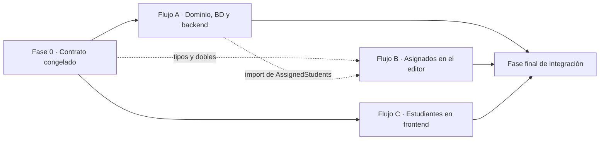

# SPEC 04 — Gestión de estudiantes (Student Management) · Plan paralelo multiagente

> **Estado:** Aprobado
> **Reorganización paralela:** 2026-09-28
> **Plan original:** `specs/04-student-management.md`
> **Depende de:** SPEC 01 — Gestión de clases; SPEC 02 — Editor de actividades; SPEC 03 — Reproductor de clases.
> **Objetivo:** Permitir que el profesor mantenga una ficha básica de cada estudiante y asigne sus clases existentes a varios estudiantes, sin convertir el producto en un sistema de gestión educativa.
> **Estrategia:** 3 flujos paralelos (uno de ellos, dominio + base de datos, estrictamente secuencial y camino crítico), 1 fase de contrato y 1 fase final de integración, sobre 5 ramas y 4 worktrees independientes, con 7 puntos de integración explícitos.

---

## 1. Resumen de la paralelización

Esta spec **sí vuelve a tocar los recursos de escritor único clásicos de este repositorio** —la carpeta
`backend/Infrastructure/Migrations/`, `AppDbContextModelSnapshot.cs` y `AppDbContext.cs`—, así que el
cuello de botella que SPEC 03 no tenía reaparece aquí y hay que decirlo sin adornos. Las etapas 1 a 8
del plan original son backend y son estrictamente secuenciales entre sí, como el propio §8 reconoce. No
se pueden paralelizar: **son un solo flujo A**, y ese flujo es el camino crítico.

Lo que sí se puede sacar del camino crítico es todo el frontend. Y aquí está la palanca real de esta
spec: **el contrato está ya escrito en el §4.4 del original**. La forma de ganar paralelismo no es
inventar un contrato nuevo, es **cerrar por escrito** el que ya existe (nombres de campo, rutas,
verbos, códigos de estado, lista de clases CSS, literales de estado) y añadir lo que el §4.4 no fija:
la **frontera de módulo** de los dos componentes compartidos (`AssignedStudents.tsx`, que el Flujo A
importa desde una página que ya existe, y el vestíbulo `frontend/src/students/` que el Flujo C importa
desde `App.tsx`). Con esa frontera congelada, los tres flujos de frontend arrancan con la API todavía
en construcción, contra tipos TypeScript y dobles de prueba.

La asimetría que más importa en el reparto: **los seis ficheros de test del frontend se quedan en el
flujo que prueba su propio código**, aunque el §7 los agrupe como «creados» junto a la spec. Son el
único mecanismo que permite a un flujo de frontend demostrar que su mitad funciona sin la app entera.
El resto de la política de pruebas se aplica igual que en SPEC 03: contrato, regresión crítica y
compilación, nada más.

| Indicador                           | Plan original                                            | Plan paralelo                                                                              |
| ----------------------------------- | -------------------------------------------------------- | ------------------------------------------------------------------------------------------ |
| Fases                               | 17 etapas secuenciales                                   | 1 de contrato + 3 flujos + 1 de integración (5 bloques)                                    |
| Flujos simultáneos máximos          | 1                                                        | 3 (A, B y C), de los cuales 2 escriben código de producción nuevo sin solaparse            |
| Camino crítico                      | 17 etapas                                                | 4 bloques: Fase 0 → Flujo A → Flujo B → Fase final de integración                          |
| Archivos con escritura compartida   | —                                                        | 2, y ambos **fuera de la fase paralela** (`LessonEditorPage.tsx`, `App.tsx`)               |
| Recursos de escritor único clásicos | migraciones, instantánea de EF, `AppDbContext.cs`        | 3, todos en el flujo A                                                                     |

**Camino crítico:** `Fase 0 → Flujo A (backend completo) → Flujo B (envoltorio) → Fase final de integración`
No se puede acortar por tres razones concretas: (a) el flujo A es el único que escribe el modelo, la
migración y la instantánea, y ninguna otra rama puede publicar el cambio de modelo mientras lo está
regenerando; (b) el flujo A es el único que importa `AssignedStudents.tsx`, así que su rama no compila
hasta que esa frontera existe; (c) la integración no puede verificar `AssignedStudents.tsx` en su sitio
real hasta que el envoltorio de la etapa 17 esté fusionado.

**Paralelismo real:** **dos flujos de verdad simultáneos (B y C), y solo con una sesión de agente por
worktree.** Si los agentes son subagentes de una misma sesión, comparten `cwd` y checkout: el
aislamiento no existe y el plan se degrada a secuencial. Y hay una condición más, específica de esta
spec: el flujo B depende de la rama del flujo A por un único import, así que **B debe arrancar desde
`spec-04-student-management` después de que la rama de A esté creada**; mientras A no la publique, B
trabaja contra los dobles y no puede comprobar la integración. Con una sola sesión, el orden honesto es
`A → C → B` sobre ramas.

---

## 2. Grafo de dependencias



| Desde       | Hacia                      | Tipo        | Tratamiento                                                                                                                                                    |
| ----------- | -------------------------- | ----------- | -------------------------------------------------------------------------------------------------------------------------------------------------------------- |
| Fase 0      | A, B, C                    | `contrato`  | **Congelar**: DTO y nombres de campo, rutas y códigos de estado, fronteras de módulo, clases CSS, textos literales. Es lo que desbloquea B y C sin el backend    |
| A           | B                          | `contrato`  | **Suave**: B importa `AssignedStudents.tsx` con la firma congelada (C4) y trabaja contra dobles; no necesita la implementación interna de A                      |
| A           | B                          | `archivo`   | **Serializar, no bloquear**: A es el único que edita `LessonEditorPage.tsx`, así que B escribe su componente y el envoltorio se añade en la fase de integración  |
| A           | C                          | `archivo`   | **Serializar**: A edita `LessonsPage.tsx` (enlace de navegación) y `App.tsx`; C crea el vestíbulo y la fase de integración los une. Disjuntos mientras tanto     |
| A           | C                          | `contrato`  | **Congelar**: las cuatro operaciones de asignación viven en el transporte del frontend; C las consume con la forma congelada, no con la implementación del servidor |
| Fase 0      | todos                      | `esquema`   | **Congelar el modelo** en la Fase 0 para que la migración se escriba temprano dentro de A; ningún otro flujo toca `AppDbContext.cs` ni la instantánea             |
| A, B, C     | Integración                | `archivo`   | **Serializar**: una fusión por rama, con verificación después de cada una                                                                                       |
| Integración | E2E                        | `entorno`   | **Planificación**: el E2E necesita la app integrada y los puertos libres; se escribe y se ejecuta solo en la integración                                        |
| Integración | Pruebas de integración     | `entorno`   | **Planificación**: PostgreSQL real, una base `pf_test_*` por clase de test, y el E2E serializado como en SPEC 02 y 03                                          |

**Aristas convertidas en congelación de contrato:** C1 (DTO y nombres de campo), C2 (rutas, verbos y
códigos de estado), C3 (fronteras de módulo), C4 (clases CSS y `data-testid`), C5 (textos literales) y
C6 (modelo de datos cerrado). Sin ellos, o B y C quedan bloqueados por A, o los dos flujos de frontend
inventan nombres distintos para los mismos campos y el merge es un re-trabajo.

---

## 3. Fase 0 — Contrato congelado

Una sola sesión, corta, antes de repartir nada. **No escribe comportamiento de producción salvo un
pequeño stub**: escribe nombres, formas y fronteras.

Como el §4.4 del original **ya contiene los DTO**, esta fase no los inventa: los cierra, añade lo que
falta (clases CSS, literales, `data-testid`, fronteras de exportación) y **crea el único fichero de
producción de esta fase**: `frontend/src/students/AssignedStudents.tsx` como stub, para que el Flujo A
compile con el import que necesita.

| Contrato                              | Artefacto                                                        | Contenido congelado                                                                                                                                                                                                                                                                                                                                                                                                                                                                                       | Consumidores |
| ------------------------------------- | ---------------------------------------------------------------- | --------------------------------------------------------------------------------------------------------------------------------------------------------------------------------------------------------------------------------------------------------------------------------------------------------------------------------------------------------------------------------------------------------------------------------------------------------------------------------------------------------- | ------------ |
| **C1 · DTO y nombres de campo**       | §4.4 del plan original, citado en §3 de este plan                | `SaveStudentRequest` = `name`, `level`, `email`, `nativeLanguage`, `interests`, `goals`, `notes`. `StudentListItemDto` = `id`, `name`, `level`, `interests`, `assignedLessonCount`, `updatedAt`, `deletedAt`. `StudentDetailsDto` = lo anterior más `email`, `nativeLanguage`, `goals`, `notes`, `createdAt`, `assignedLessons[]`. `AssignedLessonDto` = `id`, `title`, `level`, `estimatedDuration`, `inTrash`, `assignedAt`. `AssignedStudentDto` = `id`, `name`, `level`, `inTrash`, `assignedAt`. `assignedLessonCount` **cuenta también las clases en papelera** | A, B, C      |
| **C2 · Rutas, verbos y códigos**      | §5 del plan original, citado en §3 de este plan                  | Los 7 endpoints de `/api/students` con `RequireAuthorization()`. Éxitos: 200 listado y ficha, 201 alta y **asignación idempotente**, 200 edición, 204 traspaso, restauración, borrado y desasignación. Errores: 401 sin sesión; 404 entidad inexistente, ajena, o **desasignación de una pareja que no existe**; 400 con `ValidationProblemDetails` y las claves de campo; 400 al asignar una entidad **en papelera**; 409 al enviar a papelera algo ya en papelera o restaurar algo activo. Cuerpo de la asignación: `{ studentId }` en las rutas de lección y `{ lessonId }` en las de estudiante  | A, B, C      |
| **C3 · Fronteras de módulo**          | `frontend/src/students/AssignedStudents.tsx` (**stub**) y §3      | `export type AssignedStudentsProps = { lessonId: string; userId: string }` y `export default function AssignedStudents({ lessonId, userId }: AssignedStudentsProps)`. Exportaciones de `student-api.ts` consumidas por A y C: `StudentLevel`, `StudentFilters`, `listStudents`, `getStudent`, `saveStudent`, `transitionStudent`, `listAssignedStudents`, `assignStudentToLesson`, `unassignStudentFromLesson`, `listAssignedLessons`, `assignLessonToStudent`, `unassignLessonFromStudent`, `studentListKey`, `studentDetailKey`. Export por defecto de las cuatro páginas nuevas   | A, B, C      |
| **C4 · Clases CSS y ganchos E2E**     | §3 de este plan + `frontend/src/styles.css` (propietario: Flujo C) | Clases nuevas: `students-page`, `students-navigation`, `students-filters`, `student-list`, `student-actions`, `student-profile`, `student-profile-fields`, `student-assigned-lessons`, `assigned-lessons-empty`, `student-picker`, `assigned-students`, `assigned-students-empty`, `trash-mark`. Se **reutilizan** sin cambios `card`, `button`, `button secondary`, `danger`, `eyebrow`, `level-badge`, `lesson-list`, `lesson-actions`, `error`, `status`, `footnote`. `data-testid`: `students-page`, `student-form`, `student-profile`, `assigned-lessons`, `assigned-students`, `student-picker`, `trash-mark` | A, B, C, E2E |
| **C5 · Textos literales**             | §3 de este plan                                                  | «Sin indicar», «Duración incompleta», «En papelera», «Asignar clase», «Asignar estudiante», «Quitar asignación», «Crear estudiante», «Limpiar filtros», «Aún no tienes estudiantes.», «No hay estudiantes que coincidan con estos filtros.», «La papelera está vacía.», «Este estudiante todavía no tiene clases asignadas.», «Esta clase todavía no tiene estudiantes asignados.», «El estudiante no existe o no está disponible.», «La clase no existe o no está disponible.». **`formatLessonDuration` se reutiliza** tal cual, nunca se reimplementa | A, B, C, E2E |
| **C6 · Modelo de datos cerrado**      | §4 del plan original, citado en §3 de este plan                  | `Student` con `Id`, `UserId`, `Name` (200), `Email` (254), `Level` (`LessonLevel`), `NativeLanguage` (100), `Interests` (2000), `Goals` (2000), `Notes` (4000), `CreatedAt`, `UpdatedAt`, `DeletedAt`. `LessonAssignment` con `Id`, `StudentId`, `LessonId`, `AssignedAt`, **sin `Status`**. Índice único `(StudentId, LessonId)`. Índices `(UserId, UpdatedAt)` y `(UserId, DeletedAt)` en `Students`, `(LessonId)` en `LessonAssignments`. Cascadas en las dos claves foráneas. Navegación de `Lesson` a asignaciones con `HasField("_assignments")` y `PropertyAccessMode.Field`. **Ninguna columna nueva en `Lessons` ni en `Activities`** | A            |

- **Entregable:** los seis contratos cerrados, sin ningún nombre sin decidir; el stub
  `frontend/src/students/AssignedStudents.tsx` en la rama de contrato; y la lista de clases CSS y de
  literales escrita, de modo que ningún flujo tenga que inventar una cadena o un selector.
- **Verificación:** `cd frontend && npx tsc -b` en verde con el stub presente y
  `dotnet build Profefacilisimo.slnx --no-restore` en verde con el árbol intacto. Revisión de que
  ningún nombre de C1, C4 o C5 aparece escrito de dos formas distintas en este plan.
- **Criterio de finalización:** C1–C6 cerrados, los dos comandos anteriores en verde, y el stub existe.
  Si algo de esta tabla cambia después de repartir los flujos, rompe dos flujos a la vez: es el único
  punto del plan que no admite revisión tardía.
- **Rama / worktree:** `spec-04-student-management--contract` en `../pf-wt-contract`

---

## 4. Fases y flujos paralelos

> **Inventario de archivos:** derivado del §7 del plan original (que sí lo lista) y cruzado con
> `spec_inventory.py`, que detectó 7 rutas repetidas en más de una sección y 5 nombres sueltos sin
> carpeta: `LessonMigrationTests.cs` → `tests/Integration.Tests/LessonMigrationTests.cs`;
> `e2e/students.spec.ts`, `spec.ts`, `test.ts`, `test.tsx` → falsos positivos de nombres genéricos
> dentro de las listas del §7 (se resuelven a las rutas reales que sí aparecen completas).

---

### Fase 1 · Flujo A — Dominio, base de datos y backend

| Campo                                        | Valor                                                                                                                                                                                                                                                                                                                                                                  |
| -------------------------------------------- | ---------------------------------------------------------------------------------------------------------------------------------------------------------------------------------------------------------------------------------------------------------------------------------------------------------------------------------------------------------------------- |
| **Objetivo**                                 | Construir las dos entidades nuevas, la migración y la superficie completa de la API de estudiantes y asignaciones.                                                                                                                                                                                                                                                    |
| **Entregable**                               | `AddStudentsAndLessonAssignments` aplicada sobre una base limpia sin tocar `Lessons` ni `Activities`; los 7 endpoints de `/api/students` y los 4 de asignación respondiendo con los códigos de C2; `StudentTests.cs` y los dos ficheros de integración en verde.                                                                                                      |
| **Archivos que posee (escritura exclusiva)** | `backend/Domain/Student.cs`, `backend/Domain/LessonAssignment.cs`, `backend/Domain/Lesson.cs`, `backend/Application/Contracts.cs`, `backend/Application/Students/StudentDtos.cs`, `backend/Application/Students/IStudentReader.cs`, `backend/Application/Students/IStudentService.cs`, `backend/Infrastructure/AppDbContext.cs`, `backend/Infrastructure/StudentReader.cs`, `backend/Infrastructure/StudentService.cs`, `backend/Infrastructure/Migrations/*AddStudentsAndLessonAssignments*`, `backend/Infrastructure/Migrations/AppDbContextModelSnapshot.cs`, `backend/Api/StudentEndpoints.cs`, `backend/Api/Program.cs`, `tests/Domain.Tests/StudentTests.cs`, `tests/Integration.Tests/StudentManagementTests.cs`, `tests/Integration.Tests/LessonAssignmentTests.cs`, `tests/Integration.Tests/LessonMigrationTests.cs` |
| **Archivos compartidos (solo lectura)**      | `backend/Infrastructure/LessonReader.cs`, `backend/Infrastructure/LessonService.cs`, `backend/Api/LessonEndpoints.cs`, `backend/Application/Lessons/*`, `backend/Domain/Activity.cs`, `frontend/**`                                                                                                                                                                     |
| **Depende de**                               | Fase 0 (`contrato`): C1, C2 y C6. **No depende de ningún otro flujo.**                                                                                                                                                                                                                                                                                                 |
| **Bloquea a**                                | Flujo B (`contrato`, por la firma de C3 y por el import de `AssignedStudents.tsx`), Flujo C (`contrato`, por C2) y la fase de integración                                                                                                                                                                                                                             |
| **Rama**                                     | `spec-04-student-management--backend`                                                                                                                                                                                                                                                                                                                                  |
| **Worktree**                                 | `../pf-wt-backend`                                                                                                                                                                                                                                                                                                                                                     |
| **Agente sugerido**                          | agente backend .NET / EF Core, con criterio de migraciones                                                                                                                                                                                                                                                                                                             |
| **Duración relativa**                        | **L** — la más larga del plan; absorbe las 8 etapas de backend del original y es el camino crítico                                                                                                                                                                                                                                                                      |

**Tareas**

| #   | Tarea                                                                                                                                                            | Archivos                                                                                                 | Verificación                                                                                                          | Pruebas mínimas                                                                                          |
| --- | ---------------------------------------------------------------------------------------------------------------------------------------------------------------- | -------------------------------------------------------------------------------------------------------- | --------------------------------------------------------------------------------------------------------------------- | -------------------------------------------------------------------------------------------------------- |
| 1.1 | Entidad `Student` con sus reglas: `Name` y `Level` obligatorios, opcionales recortados y normalizados a `null`                                                    | `Student.cs`, `StudentTests.cs`                                                                          | `dotnet test tests/Domain.Tests/Domain.Tests.csproj --no-restore`                                                     | `StudentTests.cs`: campos obligatorios, longitudes máximas, opcionales vacíos, nivel inválido             |
| 1.2 | Entidad `LessonAssignment`: creación, `AssignedAt` y regla de unicidad de pareja en el dominio                                                                    | `LessonAssignment.cs`, `StudentTests.cs`                                                                 | igual que 1.1                                                                                                         | `StudentTests.cs`: creación, `AssignedAt`, igualdad de pareja                                            |
| 1.3 | Configuración de EF: tablas, longitudes, `CK_Student_Level`, `CK_Student_Name`, índice único de pareja, índices de consulta y cascadas; `DbSet` nuevos               | `AppDbContext.cs`                                                                                        | `dotnet build backend/Infrastructure/Infrastructure.csproj --no-restore`                                              | ninguna                                                                                                  |
| 1.4 | Navegación de solo lectura de `Lesson` hacia sus asignaciones con respaldo en campo privado                                                                       | `Lesson.cs`                                                                                              | `dotnet build Profefacilisimo.slnx --no-restore`                                                                      | ninguna                                                                                                  |
| 1.5 | Migración `AddStudentsAndLessonAssignments` y regeneración de la instantánea                                                                                       | `Migrations/*AddStudentsAndLessonAssignments*`, `AppDbContextModelSnapshot.cs`                            | `dotnet ef migrations script` sobre base desechable: solo `CREATE TABLE`, `CREATE INDEX` y las dos FK; ningún `ALTER TABLE "Lessons"` | `LessonMigrationTests.cs` ampliado: aplicar sobre una base con clases y actividades y comprobar que siguen intactas |
| 1.6 | `IStudentReader` y `StudentReader`: listado con búsqueda por nombre e intereses, filtro por nivel, orden por `UpdatedAt` descendente con desempate por `Id`, conteo de asignadas y ficha con clases asignadas incluida la papelera | `Contracts.cs`, `Application/Students/StudentDtos.cs`, `Application/Students/IStudentReader.cs`, `StudentReader.cs` | `dotnet build` + la suite de integración de 1.8                                                                       | ninguna en esta tarea; van a `StudentManagementTests.cs`                                                  |
| 1.7 | `IStudentService` y `StudentService`: crear, editar, enviar a papelera, restaurar y eliminar definitivamente, con validación previa y sin persistencia parcial        | `Application/Students/IStudentService.cs`, `StudentService.cs`                                            | `dotnet build` + la suite de integración de 1.8                                                                       | ninguna en esta tarea; van a `StudentManagementTests.cs`                                                  |
| 1.8 | `StudentManagementTests.cs`: filtros combinados, orden, aislamiento entre profesores, papelera, validación, 404 de ajeno, 409 de estado y cascada de asignaciones    | `tests/Integration.Tests/StudentManagementTests.cs`                                                       | `./scripts/Test.ps1` con `TEST_DATABASE_CONNECTION` y PostgreSQL real                                                  | la propia suite, **contra la API o el servicio, nunca con EF InMemory**                                   |
| 1.9 | Servicio único de asignación: asignar en las dos direcciones, quitar en las dos direcciones, idempotencia, rechazo de entidades en papelera y de entidades ajenas    | `StudentService.cs` (o el servicio de asignación que A decida dentro del mismo fichero)                   | `dotnet build` + la suite de 1.10                                                                                     | ninguna en esta tarea                                                                                    |
| 1.10 | `LessonAssignmentTests.cs`: idempotencia, unicidad, simetría y cascada al eliminar estudiantes y clases                                                        | `tests/Integration.Tests/LessonAssignmentTests.cs`                                                        | `./scripts/Test.ps1` con PostgreSQL real                                                                               | la propia suite                                                                                          |
| 1.11 | `StudentEndpoints` más los cuatro endpoints de asignación, con registro de los servicios y `app.MapStudentEndpoints()`                                            | `Api/StudentEndpoints.cs`, `Api/Program.cs`                                                               | pruebas de integración de códigos 201, 204, 400, 404 y 409                                                             | dentro de las dos suites anteriores                                                                      |

- **Nota sobre `LessonMigrationTests.cs`:** el plan original lista esta ampliación en la etapa 4 pero
  **no** en el §7. La spec es la fuente de verdad, así que la tarea existe. Pertenece ya al flujo A y
  **no** genera conflicto de recurso de escritor único: cada clase de test con `IClassFixture` crea su
  propia base `pf_test_*`.
- **Nota sobre el orden interno:** 1.5 debe ejecutarse **después** de la última tarea que toque
  `AppDbContext.cs` y `Lesson.cs`. Regenerar la instantánea antes de terminar el modelo produce una
  instantánea que no corresponde al modelo y `HasPendingModelChanges()` lo detecta.

**Criterios de finalización**

- [ ] `dotnet build Profefacilisimo.slnx --no-restore` en verde dentro del worktree.
- [ ] `./scripts/Test.ps1` en verde con `TEST_DATABASE_CONNECTION` apuntando a PostgreSQL real: `Domain.Tests` e `Integration.Tests` completas.
- [ ] `dotnet ef database update` sobre una base desechable aplica `AddStudentsAndLessonAssignments` sin tocar `Lessons`, `Activities` ni las tablas de identidad.
- [ ] Ninguna columna ni índice de `Lessons` o `Activities` ha cambiado, y `CK_Student_Level` reproduce exactamente los valores de `CK_Lesson_Level`.
- [ ] `LessonAssignment` **no** tiene `Status`, y `Lesson` **no** tiene `StudentId` ni colección de estudiantes persistida aparte de la navegación de solo lectura.
- [ ] Los ficheros compartidos (`LessonReader.cs`, `LessonService.cs`, `LessonEndpoints.cs`, `Application/Lessons/*`, `Activity.cs`) **no** se han modificado.
- [ ] Ningún fichero de `frontend/**` se ha tocado.

**Riesgos de conflicto**

| Riesgo                                                                             | Mitigación                                                                                                                         |
| ---------------------------------------------------------------------------------- | ---------------------------------------------------------------------------------------------------------------------------------- |
| `Migrations/**` y `AppDbContextModelSnapshot.cs` son recursos de escritor único      | Un solo flujo los escribe en todo el plan; ninguna otra rama abre la carpeta                                                        |
| La instantánea se regenera antes de terminar el modelo                              | La tarea 1.5 es la penúltima del bloque de modelo y se verifica con `HasPendingModelChanges()`                                     |
| La migración toca una tabla existente por accidente                                 | La tarea 1.5 se verifica con `dotnet ef migrations script` y `LessonMigrationTests.cs`: cualquier `ALTER TABLE "Lessons"` es un fallo |
| `backend/Api/bin` bloqueado por una API en ejecución → `MSB3021`/`MSB3027`          | Es un fallo de copia, no de compilación: diagnosticar con `dotnet build backend/Infrastructure/Infrastructure.csproj --no-restore`  |
| Las dos suites nuevas comparten clase de test y se contaminan                        | Una clase por escenario: `StudentManagementTests` y `LessonAssignmentTests` son clases distintas, y `LessonMigrationTests` ya lo es |

---

### Fase 2 · Flujo B — Estudiantes asignados dentro del editor de clases

> **Este flujo es la corrección de un anti-patrón.** La etapa 15 del original incluye la sección
> `AssignedStudents` «en el detalle de la clase». El detalle de la clase de este repositorio **es** el
> editor (`/lessons/:id/edit` → `LessonEditorPage.tsx`); no existe otra página de detalle. Un agente
> que mantenga esa suposición creerá que puede escribir una página nueva, y no es así. La sección se
> compone con la página que **ya existe**, y por eso `LessonEditorPage.tsx` pertenece al Flujo A y este
> flujo escribe su componente y su suite, nada más.

| Campo                                        | Valor                                                                                                                                                     |
| -------------------------------------------- | --------------------------------------------------------------------------------------------------------------------------------------------------------- |
| **Objetivo**                                 | Implementar `AssignedStudents`: la sección de estudiantes asignados dentro de la ficha de la clase, independiente del borrador de actividades.             |
| **Entregable**                               | `AssignedStudents.tsx` renderiza la lista (nombre, nivel, enlace a la ficha, marca «En papelera»), el estado vacío, el selector de estudiantes activos y **Quitar asignación**, contra dobles de prueba con la forma congelada de C1 y C3. |
| **Archivos que posee (escritura exclusiva)** | `frontend/src/students/AssignedStudents.tsx` (implementación; el stub lo crea la Fase 0), `frontend/src/students/AssignedStudents.test.tsx`                |
| **Archivos compartidos (solo lectura)**      | `frontend/src/students/student-api.ts` (aún no existe: se consume desde la forma congelada de C3 y los dobles), `frontend/src/students/student-schema.ts`, `frontend/src/styles.css`, `frontend/src/lessons/LessonEditorPage.tsx` |
| **Depende de**                               | Fase 0 (`contrato`): C1, C3, C4 y C5. De A depende solo en tiempo de ejecución (`contrato`, suave)                                                        |
| **Bloquea a**                                | La fase de integración (I6 e I7)                                                                                                                         |
| **Rama**                                     | `spec-04-student-management--assigned-students`                                                                                                          |
| **Worktree**                                 | `../pf-wt-assigned-students`                                                                                                                              |
| **Agente sugerido**                          | agente frontend React / TypeScript                                                                                                                       |
| **Duración relativa**                        | **S** — una etapa del original                                                                                                                            |

**Tareas**

| #   | Tarea                                                                                                                                                     | Archivos                    | Verificación                                              | Pruebas mínimas                                                                                                                    |
| --- | --------------------------------------------------------------------------------------------------------------------------------------------------------- | --------------------------- | --------------------------------------------------------- | ---------------------------------------------------------------------------------------------------------------------------------- |
| 2.1 | Sustituir el stub por la implementación: lista de asignados con nombre, nivel y enlace a `/students/:id`                                                    | `AssignedStudents.tsx`      | `npx tsc -b`                                              | ninguna                                                                                                                            |
| 2.2 | Estado vacío explícito «Esta clase todavía no tiene estudiantes asignados.» con la acción **Asignar estudiante**                                            | `AssignedStudents.tsx`      | `npx vitest run src/students/AssignedStudents.test.tsx`   | `AssignedStudents.test.tsx`: estado vacío con acción                                                                               |
| 2.3 | Selector de estudiantes activos; no ofrece los ya asignados; si no hay candidatos enlaza a **Crear estudiante**                                            | `AssignedStudents.tsx`      | pruebas del selector                                      | `AssignedStudents.test.tsx`: candidatos filtrados, entidad ya asignada ausente, sin candidatos con enlace                          |
| 2.4 | **Quitar asignación** con desasignación optimista bloqueada: no elimina al estudiante, no navega, y ante un fallo de red deja la pantalla como estaba y ofrece reintento | `AssignedStudents.tsx`      | pruebas de la acción y del fallo                          | `AssignedStudents.test.tsx`: quitar sin navegar, marca «En papelera» sin acción, fallo de red con reintento y sin reflejar el cambio |
| 2.5 | Independencia del borrador: la sección no forma parte de `lessonDraftSchema` ni de `draftFingerprint` y no marca la clase como modificada                    | `AssignedStudents.tsx`      | prueba con borrador a medias                              | `AssignedStudents.test.tsx`: se puede usar con `activityDraftSchema` a medias                                     |

**Criterios de finalización**

- [ ] La firma `AssignedStudentsProps` coincide **exactamente** con la congelada en C3: el Flujo A la importa y no puede cambiar.
- [ ] `cd frontend && npx tsc -b && npx eslint .` en verde.
- [ ] `npx vitest run src/students/AssignedStudents.test.tsx` en verde.
- [ ] `styles.css` **no** se ha modificado: B usa las clases de C4, no crea ninguna.
- [ ] `LessonEditorPage.tsx` **no** se ha modificado: el envoltorio lo añade el Flujo A.
- [ ] La sección no importa nada de `lesson-schema.ts` que la haga partícipe del borrador (`lessonDraftSchema`, `draftFingerprint`).

**Riesgos de conflicto**

| Riesgo                                                                     | Mitigación                                                                                                                    |
| -------------------------------------------------------------------------- | ----------------------------------------------------------------------------------------------------------------------------- |
| El agente escribe la sección en una página de detalle de clase que no existe | Especificado arriba: el detalle es el editor, y el envoltorio pertenece a A                                                    |
| La sección se acopla al borrador y reabre el guardado conjunto de SPEC 02   | La tarea 2.5 lo prohíbe explícitamente y la prueba lo comprueba con un borrador a medias                                      |
| La firma del componente cambia y rompe el Flujo A                           | C3 la congela; cambiarla es un punto de integración, no una decisión del flujo                                                |
| Clases CSS inventadas por B                                                 | Solo se usan las de C4; cualquier necesidad nueva se reporta y se resuelve en la integración                                    |

---

### Fase 3 · Flujo C — Estudiantes en el frontend

| Campo                                        | Valor                                                                                                                                                                                                                                                                                                                                                                             |
| -------------------------------------------- | ---------------------------------------------------------------------------------------------------------------------------------------------------------------------------------------------------------------------------------------------------------------------------------------------------------------------------------------------------------------------------------- |
| **Objetivo**                                 | Construir el vestíbulo de estudiantes: listado, alta, edición, ficha con sus clases asignadas y papelera.                                                                                                                                                                                                                                                                          |
| **Entregable**                               | Las cinco pantallas de estudiantes funcionando contra dobles con la forma congelada; `student-api.ts` con las cuatro operaciones de asignación; `styles.css` con los estilos nuevos; y los seis ficheros de test del §7 en verde.                                                                                                                                                    |
| **Archivos que posee (escritura exclusiva)** | `frontend/src/students/student-api.ts`, `student-api.test.ts`, `student-schema.ts`, `student-schema.test.ts`, `StudentsPage.tsx`, `StudentsPage.test.tsx`, `StudentFormPage.tsx`, `StudentFormPage.test.tsx`, `StudentProfilePage.tsx`, `StudentProfilePage.test.tsx`, `StudentsTrashPage.tsx`, `AssignedLessons.tsx`, `AssignedLessons.test.tsx`, `frontend/src/styles.css` |
| **Archivos compartidos (solo lectura)**      | `frontend/src/App.tsx`, `frontend/src/lessons/LessonsPage.tsx`, `frontend/src/lessons/lesson-duration.ts`, `frontend/src/auth.ts`, `frontend/src/validation.ts`, `frontend/src/students/AssignedStudents.tsx` (stub de la Fase 0)                                                                                                                                                   |
| **Depende de**                               | Fase 0 (`contrato`): C1, C2, C3, C4 y C5. **No depende de A ni de B.**                                                                                                                                                                                                                                                                                                              |
| **Bloquea a**                                | La fase de integración (I3, I5 e I6)                                                                                                                                                                                                                                                                                                                                               |
| **Rama**                                     | `spec-04-student-management--students-ui`                                                                                                                                                                                                                                                                                                                                          |
| **Worktree**                                 | `../pf-wt-students-ui`                                                                                                                                                                                                                                                                                                                                                             |
| **Agente sugerido**                          | agente frontend React / TypeScript con criterio de CSS                                                                                                                                                                                                                                                                                                                             |
| **Duración relativa**                        | **M–L** — absorbe las etapas 9 a 14 y la 16 del original, más los estilos                                                                                                                                                                                                                                                                                                          |

**Tareas**

| #   | Tarea                                                                                                                                                                     | Archivos                                                                      | Verificación                                                                    | Pruebas mínimas                                                                                                                       |
| --- | ------------------------------------------------------------------------------------------------------------------------------------------------------------------------ | ----------------------------------------------------------------------------- | ------------------------------------------------------------------------------- | ------------------------------------------------------------------------------------------------------------------------------------- |
| 3.1 | Transporte: listado con `state`/`search`/`level`, ficha, guardado, transiciones y las cuatro operaciones de asignación; `studentListKey` y `studentDetailKey`             | `student-api.ts`                                                              | `npx vitest run src/students/student-api.test.ts`                               | `student-api.test.ts`: construcción de rutas, errores 401, 404 y 409                                                                  |
| 3.2 | Esquema Zod: `name` y `level` obligatorios, opcionales que se transforman a `null`, correo validado con máximo 254                                                       | `student-schema.ts`                                                           | `npx vitest run src/students/student-schema.test.ts`                            | `student-schema.test.ts`: campo vacío, cadena solo con espacios, correo inválido, longitud excedida                                    |
| 3.3 | Listado con búsqueda por nombre e intereses, filtro por nivel, orden, estados de carga/error/vacío/vacío filtrado y acciones **Ver ficha**, **Editar** y **Enviar a papelera** | `StudentsPage.tsx`                                                            | `npx vitest run src/students/StudentsPage.test.tsx`                             | `StudentsPage.test.tsx`: filtros combinados, vacío, vacío filtrado, acciones, número de clases asignadas                               |
| 3.4 | Alta y edición con el formulario compartido y los errores señalados por campo; sin petición de escritura con datos inválidos                                               | `StudentFormPage.tsx`                                                         | `npx vitest run src/students/StudentFormPage.test.tsx`                          | `StudentFormPage.test.tsx`: alta, edición, campos obligatorios, sin escritura con datos inválidos                                     |
| 3.5 | Ficha con la información pedagógica, «Sin indicar» en los opcionales, 404 con salida al listado, **Editar** y **Enviar a papelera**                                       | `StudentProfilePage.tsx`                                                      | `npx vitest run src/students/StudentProfilePage.test.tsx`                       | `StudentProfilePage.test.tsx`: todos los campos, opcionales ausentes, 404 con salida                                                  |
| 3.6 | `AssignedLessons`: clases asignadas en la ficha con título, nivel y duración vía `formatLessonDuration`, marca «En papelera» sin acción y **Quitar asignación** sin salir de la ficha | `AssignedLessons.tsx`                                                         | `npx vitest run src/students/AssignedLessons.test.tsx`                          | `AssignedLessons.test.tsx`: duración, «Duración incompleta», papelera sin acción, quitar sin navegar                                  |
| 3.7 | Acción **Asignar clase** en la ficha: selector de clases activas, sin ofrecer las ya asignadas, con enlace a **Crear clase** cuando no hay candidatas                        | `StudentProfilePage.tsx`, `AssignedLessons.tsx`                               | pruebas del selector                                                            | en las dos suites anteriores                                                                                                          |
| 3.8 | Papelera de estudiantes con **Restaurar** y **Eliminar definitivamente**, con la confirmación de `window.confirm`                                                          | `StudentsTrashPage.tsx`                                                       | suite propia de la papelera                                                     | papelera: listado, restaurar, eliminar definitivamente, confirmación y vacío                                                          |
| 3.9 | Estilos de las pantallas nuevas, de la ficha y de la sección de asignados, como adiciones al final del fichero                                                             | `styles.css`                                                                  | revisión contra la lista de clases de C4 y `npx eslint .`                       | ninguna                                                                                                                              |
| 3.10 | Comportamiento en pantalla estrecha: apilado del listado, de la ficha y de las acciones                                                                                  | `styles.css`                                                                  | **sin verificación ejecutable en este flujo**: el marcado completo vive en la integración. Se verifica en I5                            | ninguna                                                                                                                              |

**Criterios de finalización**

- [ ] `cd frontend && npx tsc -b && npx eslint .` en verde.
- [ ] `npx vitest run src/students` en verde: las seis suites del §7 más la de la papelera.
- [ ] `student-api.ts` expone **exactamente** los nombres congelados en C3, y su forma de error conserva `ValidationProblemDetails` como `LessonSaveError` lo hace en `lesson-api.ts`.
- [ ] `styles.css` no ha perdido ninguna regla existente: los cambios son adiciones al final del fichero, y cada clase de C4 tiene su regla y ninguna regla queda huérfana.
- [ ] El flujo **no** ha modificado `App.tsx`, ni `LessonsPage.tsx`, ni `AssignedStudents.tsx`, ni ningún archivo de `backend/**`.
- [ ] El listado y la ficha **nunca** muestran una asignación que no ha confirmado el servidor: la interfaz espera la respuesta antes de reflejarla.

**Riesgos de conflicto**

| Riesgo                                                                        | Mitigación                                                                                                     |
| ----------------------------------------------------------------------------- | -------------------------------------------------------------------------------------------------------------- |
| `frontend/src/styles.css` es la única hoja global del proyecto                | Un solo propietario en todo el plan (C); las adiciones van al final y B no lo abre para escribir                |
| Se reimplementa el formateo de duración en vez de reutilizarlo                 | C5 congela `formatLessonDuration` y «Duración incompleta» como reutilización obligatoria                        |
| El listado y la ficha divergen en el conteo de clases asignadas                | `assignedLessonCount` incluye las clases en papelera (C1): es el mismo número en las dos pantallas              |
| El 404 de estudiante y el de clase se confunden                               | C5 fija los dos literales por separado, con su enlace de salida respectivo                                      |
| Estilos escritos contra un marcado que aún no existe en la app integrada       | La Fase 0 congela las clases y los `data-testid`; el ajuste fino se cierra en I3, I5 e I6                       |

---

## 5. Estrategia de ramas y worktrees

| Rama                                                | Base                            | Propósito                  | Worktree                     | Se fusiona en                   |
| --------------------------------------------------- | ------------------------------- | -------------------------- | ---------------------------- | ------------------------------- |
| `spec-04-student-management`                        | `main`                          | integración                | checkout principal           | —                               |
| `spec-04-student-management--contract`              | `spec-04-student-management`    | Fase 0                     | `../pf-wt-contract`          | `spec-04-student-management`    |
| `spec-04-student-management--backend`               | `spec-04-student-management`    | Flujo A                    | `../pf-wt-backend`           | `spec-04-student-management`    |
| `spec-04-student-management--students-ui`           | `spec-04-student-management`    | Flujo C                    | `../pf-wt-students-ui`       | `spec-04-student-management`    |
| `spec-04-student-management--assigned-students`     | `spec-04-student-management`    | Flujo B                    | `../pf-wt-assigned-students` | `spec-04-student-management`    |

**Comandos de creación**

```bash
git checkout -b spec-04-student-management

git worktree add ../pf-wt-contract          -b spec-04-student-management--contract          spec-04-student-management
git worktree add ../pf-wt-backend           -b spec-04-student-management--backend           spec-04-student-management
git worktree add ../pf-wt-students-ui       -b spec-04-student-management--students-ui       spec-04-student-management
git worktree add ../pf-wt-assigned-students -b spec-04-student-management--assigned-students spec-04-student-management
```

O con el script del skill, que planifica en seco y solo ejecuta con `--apply`:

```bash
bash "$SKILL_DIR/scripts/worktrees.sh" spec-04-student-management \
  contract backend students-ui assigned-students
```

**Bootstrap obligatorio de cada worktree**

`obj/`, `bin/`, `node_modules/` y `.tools/` están en `.gitignore`, así que un worktree nuevo no
compila. En esta spec **los tres flujos tocan las dos mitades del proyecto**, así que el bootstrap es
el completo, no el ligero de SPEC 03:

1. Artefactos de compilación: `dotnet restore`; si falla en este entorno —falla—, copiar `obj/` del
   checkout principal para `backend/{Domain,Application,Infrastructure,Api}` y
   `tests/{Domain.Tests,Integration.Tests}`, y verificar dentro del worktree con
   `dotnet build backend/Infrastructure/Infrastructure.csproj --no-restore`.
2. Copiar `.tools/local-settings.json`: lo necesitan las pruebas de integración y `dotnet ef`
   (que exige `Jwt__SigningKey` incluso para `database update`).
3. `frontend/node_modules`: `npm ci` dentro del worktree, o copiar la carpeta existente (~186 MB).
4. Verificar antes de entregar el worktree: `dotnet build Profefacilisimo.slnx --no-restore` **y**
   `cd frontend && npx tsc -b` en verde. El Flujo B no necesita el paso 1 completo, pero sí los pasos
   2 y 3, y el paso 4 para `npx tsc -b`.

**Orden de fusión** (no negociable, sigue la dirección de las dependencias):

`contract → backend → students-ui → assigned-students`

Una rama cada vez, con la verificación de la fase ejecutada antes de fusionar la siguiente. Nunca una
fusión múltiple: oculta qué flujo rompió la compilación. **El orden importa más que en SPEC 03**: la
verificación del Flujo A incluye `dotnet build Profefacilisimo.slnx --no-restore` sobre el árbol
completo, y esa comprobación no puede ejecutarse mientras `AssignedStudents.tsx` siga siendo un stub
sin el envoltorio.

**Reglas de resolución de conflictos**, fijadas antes de empezar para no improvisarlas:

| Clase de conflicto                                          | Regla                                                                                                                       |
| ----------------------------------------------------------- | --------------------------------------------------------------------------------------------------------------------------- |
| `backend/Infrastructure/Migrations/**` y `AppDbContextModelSnapshot.cs` | Gana el Flujo A. La otra parte se regenera, **nunca** se fusiona a mano                                          |
| `backend/Infrastructure/AppDbContext.cs`                    | Gana el Flujo A; nadie más lo escribe                                                                                       |
| `backend/Domain/Lesson.cs`                                  | Gana el Flujo A; es una adición de navegación, no un cambio de reglas                                                       |
| DTO y contratos C1–C6                                       | Gana la versión congelada en la Fase 0. Cualquier desviación es un error del flujo que se desvió                             |
| `frontend/src/students/AssignedStudents.tsx`                | El stub de la Fase 0 se descarta: gana la implementación del Flujo B                                                        |
| `frontend/src/styles.css`                                   | Solo lo escribe el Flujo C. Si apareciera un conflicto, es aditivo: se conservan ambos bloques y se revisa el orden a mano  |
| `frontend/src/lessons/LessonEditorPage.tsx` y `frontend/src/App.tsx` | Gana la fase de integración: son los dos puntos de contacto entre flujos y ninguno los escribe en paralelo          |
| `frontend/src/lessons/LessonsPage.tsx`                      | Gana la fase de integración: se parte del original y se añade el enlace a **Estudiantes**                                   |
| Documentación                                               | Se concatena; no se descarta ninguna sección                                                                                |
| Criterios de aceptación y spec                              | **Nunca se editan** para que cuadren con lo construido                                                                      |

---

## 6. Puntos de integración

| Id     | Punto                                                            | Flujos    | Artefacto                                                                        | Cuándo                                     | Quién actúa                    | Comprobación                                                                                                                                |
| ------ | ---------------------------------------------------------------- | --------- | -------------------------------------------------------------------------------- | ------------------------------------------ | ------------------------------ | ------------------------------------------------------------------------------------------------------------------------------------------- |
| **I0** | Contrato congelado                                               | todos     | §3 de este plan + el stub `AssignedStudents.tsx`                                  | antes de arrancar cualquier flujo          | agente de contrato             | C1–C6 cerrados, sin nombres sin decidir; `npx tsc -b` y `dotnet build` en verde con el stub                                                 |
| **I1** | Migración aplicada                                               | A → todo  | `Migrations/*AddStudentsAndLessonAssignments*` + instantánea regenerada           | al terminar A, antes de abrir su rama      | agente backend                 | `dotnet ef database update` sobre base desechable, y `LessonMigrationTests.cs` en verde sin tocar `Lessons` ni `Activities`                  |
| **I2** | DTO ↔ tipos del frontend                                         | A ↔ C     | §4.4 del original frente a `student-api.ts`                                       | al fusionar backend, antes de `students-ui` | agente de integración          | una respuesta real de `GET /api/students` y `GET /api/students/{id}` comparada campo por campo con la forma congelada                        |
| **I3** | Endpoints en vivo ↔ transporte del frontend                      | A ↔ C     | rutas, verbos y códigos de C2 frente a `student-api.ts`                           | primera integración de C                   | agente de integración          | listar, crear, editar, traspasar, restaurar, eliminar y las cuatro operaciones de asignación funcionan extremo a extremo                    |
| **I4** | `AssignedStudents.tsx`: stub → implementación real                | B → A     | `frontend/src/students/AssignedStudents.tsx`                                      | al fusionar `assigned-students`            | agente de integración          | el import del Flujo A compila y las pruebas del Flujo B pasan sin cambios al sustituir el stub                                              |
| **I5** | Estilos ↔ marcado real                                           | C ↔ A, B  | `styles.css` frente al DOM de la ficha, la sección y el editor                    | tras fusionar los tres flujos              | agente de integración          | ninguna clase de C4 sin regla y ninguna regla huérfana; a 390 px no hay desbordamiento y las acciones siguen utilizables                      |
| **I6** | Enlaces y rutas                                                  | C, A ↔ B  | `App.tsx`, `LessonsPage.tsx`, `LessonEditorPage.tsx`                              | fase de integración                        | agente de integración          | pulsar **Estudiantes**, **Ver ficha**, el estudiante asignado en el editor y **Editar clase** en un navegador real abre la pantalla correcta |
| **I7** | Documentación ↔ comportamiento final                             | todos     | `docs/student-management.md`, `README.md`                                         | al final de la integración                 | agente de integración          | cada instrucción documentada se ejecuta tal cual y la tabla de evidencia queda completa                                                     |

**Qué se rompe si se salta cada punto**

- **I1** — las mismas dos lecciones de la spec 03, agravadas porque aquí sí hay migración. Si la
  migración toca `Lessons` o `Activities`, la migración se aplica en el orden equivocado respecto al
  modelo y `HasPendingModelChanges()` lo detecta tarde, con los tests de integración ya ejecutados
  contra una base incoherente. La reconciliación es regenerar la instantánea desde el modelo final,
  no editar la migración a mano.
- **I2** — es el fallo que más caro sale en esta spec: dos mitades verdes por separado y una pantalla
  que muestra «Sin indicar» donde el servidor manda `null` y no `""`. La reconciliación es un
  `curl` contra la API real y una comparación campo por campo, no una lectura del código.
- **I3** — el frontend codifica un 200 donde el servidor devuelve 201, o trata la asignación repetida
  como error cuando es idempotente. La reconciliación es recorrer la tabla de C2 endpoint por endpoint.
- **I4** — el stub llega a la app integrada y la sección de asignados se renderiza vacía. La
  reconciliación es sustituir el archivo entero y volver a ejecutar las pruebas del Flujo B sin
  tocarlas.
- **I5** — la ficha y la sección de asignados funcionan sin estilos y el usuario ve texto plano. La
  reconciliación es recorrer la lista de C4 clase por clase contra el DOM renderizado.
- **I6** — es exactamente el fallo ya vivido en este repositorio el 2026-09-24: un enlace que existe
  sin su ruta porque el flujo que añadió el enlace y el que registró la ruta vivían en ramas
  separadas. Las suites de componente verdes por separado **no** lo detectan. Se comprueba en
  navegador real, empezando por `curl -s http://localhost:5173/src/App.tsx | grep students`.
- **I7** — la documentación describe el comportamiento previsto, no el construido, y deja de ser
  válida como guía.

---

## 7. Matriz de propiedad de archivos

| Archivo                                                                    | Propietario                       | Lectores              | Modificado en la fase | Riesgo                                        |
| -------------------------------------------------------------------------- | --------------------------------- | --------------------- | --------------------- | --------------------------------------------- |
| `backend/Domain/Student.cs`                                                | A                                 | Integración           | 1                     | bajo                                          |
| `backend/Domain/LessonAssignment.cs`                                       | A                                 | Integración           | 1                     | bajo                                          |
| `backend/Domain/Lesson.cs`                                                 | A                                 | Integración           | 1                     | **alto** (navegación nueva en un tipo existente) |
| `backend/Application/Contracts.cs`                                         | A                                 | Integración           | 1                     | **alto** (superficie de contrato compartida)  |
| `backend/Application/Students/*`                                           | A                                 | Integración           | 1                     | bajo                                          |
| `backend/Infrastructure/AppDbContext.cs`                                    | A                                 | Integración           | 1                     | **alto** (escritor único: todo el modelo EF)  |
| `backend/Infrastructure/Migrations/**`                                     | A                                 | Integración           | 1                     | **alto** (escritor único: cadena lineal)      |
| `backend/Infrastructure/AppDbContextModelSnapshot.cs`                       | A                                 | Integración           | 1                     | **alto** (escritor único: se regenera entero) |
| `backend/Infrastructure/StudentReader.cs`, `StudentService.cs`              | A                                 | Integración           | 1                     | bajo                                          |
| `backend/Api/StudentEndpoints.cs`                                          | A                                 | Integración           | 1                     | bajo                                          |
| `backend/Api/Program.cs`                                                   | A                                 | Integración           | 1                     | **alto** (composición de la aplicación)       |
| `tests/Domain.Tests/StudentTests.cs`                                       | A                                 | —                     | 1                     | bajo                                          |
| `tests/Integration.Tests/StudentManagementTests.cs`                        | A                                 | —                     | 1                     | bajo (clase de test con su propia base)       |
| `tests/Integration.Tests/LessonAssignmentTests.cs`                         | A                                 | —                     | 1                     | bajo (clase de test con su propia base)       |
| `tests/Integration.Tests/LessonMigrationTests.cs`                          | A                                 | —                     | 1                     | medio (se amplía un fichero existente)        |
| `frontend/src/students/AssignedStudents.tsx`                               | B (stub creado en la Fase 0)      | A, C, Integración     | 0 y 2                 | **alto** (escritura doble secuencial)         |
| `frontend/src/students/AssignedStudents.test.tsx`                          | B                                 | —                     | 2                     | bajo                                          |
| `frontend/src/students/student-api.ts`                                     | C                                 | A, B, Integración     | 3                     | **alto** (transporte: la vista del contrato)  |
| `frontend/src/students/student-api.test.ts`                                | C                                 | —                     | 3                     | bajo                                          |
| `frontend/src/students/student-schema.ts`                                  | C                                 | Integración           | 3                     | medio                                         |
| `frontend/src/students/student-schema.test.ts`                             | C                                 | —                     | 3                     | bajo                                          |
| `frontend/src/students/StudentsPage.tsx` + `.test.tsx`                     | C                                 | Integración           | 3                     | bajo                                          |
| `frontend/src/students/StudentFormPage.tsx` + `.test.tsx`                  | C                                 | Integración           | 3                     | bajo                                          |
| `frontend/src/students/StudentProfilePage.tsx` + `.test.tsx`               | C                                 | Integración           | 3                     | bajo                                          |
| `frontend/src/students/StudentsTrashPage.tsx`                              | C                                 | Integración           | 3                     | bajo                                          |
| `frontend/src/students/AssignedLessons.tsx` + `.test.tsx`                  | C                                 | Integración           | 3                     | bajo                                          |
| `frontend/src/styles.css`                                                  | C                                 | A, B, Integración     | 3                     | **alto** (hoja global única)                  |
| `frontend/src/App.tsx`                                                     | **Fase de integración**           | A, C                  | 4                     | **alto** (rutas y providers)                  |
| `frontend/src/lessons/LessonEditorPage.tsx`                                | **Fase de integración**           | B, A                  | 4                     | **alto** (integración de toda la UI del editor) |
| `frontend/src/lessons/LessonsPage.tsx`                                     | **Fase de integración**           | —                     | 4                     | medio                                         |
| `frontend/e2e/students.spec.ts`                                            | **Fase de integración**           | —                     | 4                     | bajo                                          |
| `docs/student-management.md`                                               | **Fase de integración**           | —                     | 4                     | medio (reescritura completa)                  |
| `README.md`                                                                | **Fase de integración**           | —                     | 4                     | medio (aditivo, pero dos `append` se pisan)   |
| `frontend/src/lessons/lesson-api.ts`, `lesson-schema.ts`                   | **nadie: solo lectura**           | A, C, Integración     | —                     | bajo                                          |
| `frontend/src/lessons/LessonPlayerPage.tsx`, `ActivityView.tsx`            | **nadie**                         | —                     | —                     | bajo                                          |
| `frontend/src/auth.ts`, `validation.ts`                                    | **nadie: solo lectura**           | A, C                  | —                     | bajo                                          |
| `backend/Infrastructure/LessonReader.cs`, `LessonService.cs`               | **nadie: solo lectura**           | A, Integración        | —                     | bajo                                          |
| `backend/Api/LessonEndpoints.cs`, `Application/Lessons/*`                  | **nadie: solo lectura**           | A, Integración        | —                     | bajo                                          |
| `backend/Domain/Activity.cs`                                               | **nadie: solo lectura**           | A, Integración        | —                     | bajo                                          |

**Archivos de escritor único (recursos críticos):** `backend/Infrastructure/Migrations/**`,
`backend/Infrastructure/AppDbContextModelSnapshot.cs`, `backend/Infrastructure/AppDbContext.cs` (los
tres, solo del Flujo A), `backend/Api/Program.cs` (solo A), `frontend/src/styles.css` (solo C),
`frontend/src/App.tsx` y `frontend/src/lessons/LessonEditorPage.tsx` (los dos, solo la fase de
integración).

**Intersecciones detectadas y resueltas:**

| Intersección                                                                                              | Resolución                                                                                                                                                          |
| --------------------------------------------------------------------------------------------------------- | ------------------------------------------------------------------------------------------------------------------------------------------------------------------- |
| `frontend/src/lessons/LessonEditorPage.tsx` lo edita la etapa 17 del original y lo importa el Flujo B      | **Resuelta moviendo el envoltorio a la fase de integración.** El archivo queda sin propietario en la fase paralela, y así no hay una tercera persona tocando el editor |
| `frontend/src/App.tsx` lo edita la etapa 17 y lo necesita la fase de integración para el vestíbulo        | **Resuelta asignándolo entero a la fase de integración** (desviación deliberada del catálogo de puntos calientes: aquí no hay un único flujo funcional que lo reclame) |
| `frontend/src/students/student-api.ts` aparece en §7 y §8 del original                                     | Un solo propietario, el Flujo C: el §8 solo lo menciona como etapa                                                                                                   |
| `frontend/src/students/AssignedStudents.tsx` lo importa A y lo implementa B                                | **Resuelta** con el stub de la Fase 0: A compila contra la firma congelada y B reemplaza el cuerpo                                                                    |
| `frontend/src/styles.css` lo necesitan A, B y C y solo lo escribe C                                        | **Resuelta** congelando la lista de clases y los `data-testid` en C4: A y B solo las leen                                                                             |
| `tests/Domain.Tests/StudentTests.cs` aparece en §7, §8 y §9 del original                                   | Un solo propietario, el Flujo A: las tres menciones son el mismo fichero, no tres escritores                                                                          |
| `tests/Integration.Tests/LessonAssignmentTests.cs` y `StudentManagementTests.cs` aparecen en §7 y §8        | Un solo propietario, el Flujo A; son clases de test distintas y cada una abre su propia base `pf_test_*`                                                              |
| `tests/Integration.Tests/LessonMigrationTests.cs` está en la etapa 4 pero **no** en el §7                  | **Resuelta a favor del plan**: la tarea existe (es la verificación de la migración) y pertenece al Flujo A                                                            |
| `docs/student-management.md` aparece en §7 y §8                                                            | Un solo propietario, la fase de integración, donde se reescribe contra el comportamiento construido                                                                    |
| El E2E y las pruebas de integración necesitan la app entera y PostgreSQL real                              | **Resueltos** sacándolos de los flujos: viven en la fase de integración, serializados                                                                                  |

---

## 8. Riesgos de conflicto y mitigaciones

| Riesgo                                                                     | Probabilidad | Impacto | Mitigación                                                                                                                                    |
| -------------------------------------------------------------------------- | ------------ | ------- | --------------------------------------------------------------------------------------------------------------------------------------------- |
| Dos flujos regeneran la instantánea del modelo                             | baja         | alto    | Un único escritor para migraciones, instantánea y `AppDbContext.cs`: el Flujo A                                                                |
| La migración toca por accidente `Lessons` o `Activities`                   | media        | alto    | `dotnet ef migrations script` + `LessonMigrationTests.cs` ampliado como comprobación binaria, con reversión incluida                            |
| Contrato mal congelado → retrabajo en dos flujos de frontend              | media        | alto    | C1–C6 se cierran en la Fase 0 y se verifican con `npx tsc -b` antes de repartir nada                                                            |
| `frontend/src/styles.css` editado por dos flujos a la vez                  | baja         | alto    | Un único propietario (C) y adiciones al final del archivo; A y B solo leen                                                                      |
| `LessonEditorPage.tsx` editado a la vez por dos flujos                     | baja         | alto    | No tiene propietario en la fase paralela: el envoltorio es una etapa de la fase de integración                                                  |
| Enlace sin ruta (el fallo real del 2026-09-24)                             | media        | alto    | I6 se comprueba en navegador real, empezando por `curl -s http://localhost:5173/src/App.tsx | grep students`                                   |
| La sección de asignados se acopla al borrador y reabre SPEC 02             | media        | alto    | La tarea 2.5 lo prohíbe y su prueba lo comprueba con un `activityDraftSchema` a medias                                                          |
| El stub llega a la integración sin sustituir                               | baja         | alto    | I4 es un punto explícito: las pruebas del Flujo B pasan sin cambios con la implementación real                                                  |
| Se reimplementa el formateo de duración en vez de reutilizarlo             | media        | medio   | C5 congela `formatLessonDuration` y «Duración incompleta» como reutilización obligatoria                                                        |
| Dos flujos ejecutan Playwright a la vez y chocan de puerto                 | media        | medio   | El E2E no existe en ningún flujo: se escribe y se ejecuta solo en la integración, serializado                                                    |
| Las dos suites de integración nuevas comparten clase de test y se contaminan | media        | medio   | Una clase por escenario, cada una con su `IClassFixture` y su base `pf_test_*`                                                                  |
| Worktree sin `obj/` o sin `node_modules/` que no compila                    | alta         | alto    | Bootstrap completo de §5, verificado con `dotnet build --no-restore` y `npx tsc -b` antes de entregar el worktree                               |
| El Flujo B arranca su rama antes de que exista la de A                     | media        | medio   | Su único import real nace del trabajo de A; hasta entonces trabaja contra dobles con la forma congelada y su comprobación de integración es I4 |
| Los flujos se ejecutan como subagentes de una sola sesión                  | media        | alto    | Aviso de aislamiento de §1: hace falta una sesión por worktree, o ejecutar en secuencia                                                        |
| Deuda técnica acumulada en el desarrollo paralelo                          | media        | medio   | Revisión explícita en la fase de integración, etapas 8 y 9                                                                                      |

---

## 9. Fase final de integración

Trabajo planificado con sus propias etapas, no una nota al pie. Es donde viven el envoltorio del
editor, las rutas, el E2E y la verificación funcional completa.

| #   | Etapa                                            | Entrada                                                     | Actividad                                                                                                                                                                                       | Verificación                                                                                             |
| --- | ------------------------------------------------ | ----------------------------------------------------------- | ----------------------------------------------------------------------------------------------------------------------------------------------------------------------------------------------- | -------------------------------------------------------------------------------------------------------- |
| 1   | Fusión de ramas                                  | las cuatro ramas de flujo                                    | fusión en el orden `contract → backend → students-ui → assigned-students`, una a una                                                                                                            | compila después de cada fusión: `dotnet build Profefacilisimo.slnx --no-restore` y `npx tsc -b`          |
| 2   | Resolución de conflictos                         | conflictos del merge                                         | aplicar las reglas fijadas en §5, sin improvisar; la instantánea del modelo se regenera, nunca se fusiona a mano                                                                                 | `git diff` revisado, sin marcadores de conflicto, y `HasPendingModelChanges()` en falso                  |
| 3   | Ajustes frontend ↔ backend                       | contrato C1–C6 + implementación real                          | alinear nombres de campo, tipos, códigos de estado y la forma del error; comprobar que un opcional vacío llega `null` y no `""`                                                                  | una llamada real a `GET /api/students` y `GET /api/students/{id}` comparada campo por campo con la forma congelada (I2) |
| 4   | Envoltorio del editor y rutas                    | `LessonEditorPage.tsx`, `App.tsx`, `LessonsPage.tsx`          | añadir la sección de estudiantes asignados al editor como componente propio, fuera del `<form>`/borrador; registrar las cinco rutas protegidas; añadir el enlace a **Estudiantes** y el enlace recíproco con **Papelera** | `npx tsc -b` en verde y navegación real: `curl -s http://localhost:5173/src/App.tsx | grep students` (I6)  |
| 5   | Pruebas de integración                           | API + PostgreSQL real                                        | ejecutar `StudentManagementTests.cs` y `LessonAssignmentTests.cs` completas, y las suites existentes como red de regresión                                                                       | las suites en verde con `TEST_DATABASE_CONNECTION`, y `LessonMigrationTests.cs` confirmando que `Lessons` y `Activities` no cambiaron |
| 6   | E2E de estudiantes                               | app integrada, base desechable, API en el puerto 5080        | escribir `frontend/e2e/students.spec.ts`: alta, asignación desde las dos caras, papelera con sus dos transiciones y la clase en papelera marcada sin acción de quitar                             | `npx playwright test e2e/students.spec.ts` en verde, serializado                                          |
| 7   | Validación funcional completa                    | criterios de aceptación de §11                               | recorrer el checklist punto por punto                                                                                                                                                            | cada criterio verificado y con evidencia anotada en `docs/student-management.md`                          |
| 8   | Pantalla estrecha, accesibilidad y reescritura de docs | `styles.css` + marcado + `docs/student-management.md`   | comprobación a 390 px; reescribir la guía de uso y límites con la estructura de `docs/activity-editor.md`; actualizar el README y el estado de la Fase 4                                            | sin desbordamiento horizontal; la tabla del README deja de decir «Documentada — sin implementar»; I5 e I7 cerrados |
| 9   | Revisión de calidad y deuda técnica              | todo el diff de la spec                                       | revisar el trabajo paralelo: clases CSS huérfanas, literales duplicados, consultas N+1 en el lector de asignadas, `AssignedStudents` acoplado al borrador, stubs residuales                        | lista de deuda con decisión explícita (arreglar o posponer)                                              |
| 10  | Fortalecimiento de pruebas                       | huecos detectados                                             | ampliar casos límite: correo compartido, nombre repetido, longitudes máximas, idempotencia desde las dos pantallas, fallo de red al asignar, papelera con asignaciones vivas                        | pruebas nuevas en verde                                                                                   |

**Criterio de finalización de la fase:** todos los criterios de aceptación verificados con evidencia,
el árbol en verde (`dotnet build Profefacilisimo.slnx --no-restore`, `./scripts/Test.ps1`, `npx tsc -b`,
`npx eslint .`, `npx vitest run`, `npx playwright test`) y la deuda técnica revisada con decisión
explícita.

---

## 10. Política de pruebas

Durante las fases paralelas solo se escriben las pruebas estrictamente necesarias para (a) validar un
contrato congelado, (b) evitar una regresión crítica o (c) mantener el proyecto compilando y con tipos
correctos. No se trabaja en cobertura, ni en refactorización de suites, ni en E2E completos, ni en
rediseño de fixtures durante las fases paralelas: todo eso se planifica en la fase de integración (§9,
etapas 5, 6 y 10).

**Matiz propio de esta spec:** el plan original asocia un fichero de test a cada etapa, y las suites de
frontend son además el único mecanismo que permite a un flujo demostrar su mitad sin la app entera. Por
eso **los ficheros del §7 se escriben dentro de su flujo, tal como los lista la spec** —`student-api.test.ts`,
`student-schema.test.ts`, `StudentsPage.test.tsx`, `StudentFormPage.test.tsx`, `StudentProfilePage.test.tsx`,
`AssignedLessons.test.tsx`, `AssignedStudents.test.tsx`— y `StudentTests.cs`, `StudentManagementTests.cs`
y `LessonAssignmentTests.cs` dentro del Flujo A. Lo que la política prohíbe durante la fase paralela es
lo de siempre: objetivos de cobertura, suites completas, refactorización de fixtures y el E2E. Las
suites existentes se ejecutan una sola vez por flujo como red de regresión, no en cada tarea.

---

## 11. Criterios de aceptación

Copiados literalmente de `specs/04-student-management.md` §9. No se han añadido, quitado, reordenado ni
reescrito.

**Estudiantes**

- [ ] Se puede crear un estudiante con nombre y nivel; el resto de campos son opcionales.
- [ ] Crear sin nombre o sin nivel no envía ninguna petición de escritura.
- [ ] Un campo opcional vacío se guarda como ausente y se muestra como «Sin indicar» en la ficha.
- [ ] Un campo opcional con solo espacios se guarda como ausente.
- [ ] Se puede editar cualquier campo de la ficha y el resultado se ve sin recargar.
- [ ] Un correo con formato inválido, o de más de 254 caracteres, se rechaza.
- [ ] Dos estudiantes pueden compartir el mismo correo.
- [ ] El listado muestra nombre, nivel, resumen de intereses y número de clases asignadas.
- [ ] La búsqueda casa por nombre y por intereses; el filtro por nivel usa A2, B1 y B2.
- [ ] Búsqueda y filtro se combinan y **Limpiar filtros** restituye el listado completo.
- [ ] El listado se ordena por actualización descendente.
- [ ] Un profesor no ve, no edita y no elimina estudiantes de otro profesor.
- [ ] El listado vacío ofrece **Crear estudiante** y el filtrado vacío ofrece **Limpiar filtros**.

**Asignación de clases**

- [ ] Se asigna un estudiante a una clase desde el detalle de la clase.
- [ ] Se asigna una clase a un estudiante desde su ficha.
- [ ] La relación se guarda con una fila de `LessonAssignment`, nunca con un campo en `Lesson`.
- [ ] Una misma clase puede estar asignada a varios estudiantes a la vez.
- [ ] Un mismo estudiante puede tener varias clases asignadas a la vez.
- [ ] Asignar dos veces la misma pareja no crea una segunda fila y no devuelve error.
- [ ] El selector no ofrece entidades ya asignadas.
- [ ] Quitar una asignación no elimina ni la clase ni el estudiante.
- [ ] Quitar la asignación desde la ficha no sale de la ficha; quitarla desde la clase no sale de la clase.
- [ ] Quitar una asignación que no existe responde 404 y no modifica nada.
- [ ] Asignar una clase ajena o un estudiante ajeno responde 404.
- [ ] No se puede asignar una clase en papelera ni un estudiante en papelera.
- [ ] Asignar o quitar no modifica la clase: ni su contenido, ni sus actividades, ni su duración, ni su versión.
- [ ] Un fallo de red al asignar o al quitar deja la pantalla como estaba y muestra un reintento.
- [ ] La sección de asignados del editor no participa en el borrador y no marca la clase como modificada.
- [ ] Se puede usar la sección de asignados con el borrador de actividades a medias y sin guardar.

**Papelera y borrado**

- [ ] Enviar un estudiante a papelera pide confirmación y no elimina ninguna clase.
- [ ] Un estudiante en papelera conserva sus asignaciones.
- [ ] Al restaurarlo vuelven sus clases asignadas, sin duplicarse.
- [ ] Eliminar definitivamente borra al estudiante y sus asignaciones, y no borra ninguna clase.
- [ ] Eliminar definitivamente una clase con asignaciones no elimina a ningún estudiante.
- [ ] La papelera de estudiantes lista, restaura y elimina definitivamente, y pide confirmación.
- [ ] Una clase en papelera se muestra marcada en la ficha y sin acción de quitar hasta restaurarla.
- [ ] Un estudiante en papelera se muestra marcado en la clase y sin acción de quitar hasta restaurarlo.
- [ ] La ficha de un estudiante en papelera sigue siendo legible.

**Regresión y alcance**

- [ ] El listado, el editor y el reproductor de clases siguen funcionando igual.
- [ ] `GET /api/lessons/{id}` conserva exactamente sus campos y no devuelve estudiantes.
- [ ] La papelera de clases y el guardado conjunto de SPEC 02 no cambian.
- [ ] No se añade `StudentId` ni ninguna colección de estudiantes a `Lesson` ni a `Activity`.
- [ ] No se añade `Status` a `LessonAssignment`.
- [ ] No hay ninguna entidad por estudiante además de `Student` y `LessonAssignment`.
- [ ] Las tablas `Lessons`, `Activities` y de identidad no cambian en la migración.
- [ ] No se añaden dependencias ni se cambia autenticación, framework o arquitectura.
- [ ] `npx tsc -b`, `npx eslint .` y las suites existentes siguen en verde.

**Comprobaciones ejecutables al implementar**

- `dotnet build Profefacilisimo.slnx --no-restore` desde la raíz.
- `./scripts/Test.ps1` con `StudentTests.cs` y los dos ficheros nuevos de integración, usando `TEST_DATABASE_CONNECTION` y PostgreSQL real.
- `cd frontend && npx tsc -b && npx eslint .`
- `npx vitest run` con las suites nuevas de estudiantes.
- `npx playwright test e2e/students.spec.ts` sobre la base desechable y la API en el puerto 5080, con el E2E serializado como en SPEC 02 y 03.

No se han ejecutado estas comprobaciones durante la redacción.

---

## 12. Registro de cambios respecto a la spec original

| Cambio                                                                                                                        | Motivo                                                                                                                                                             |
| ----------------------------------------------------------------------------------------------------------------------------- | ------------------------------------------------------------------------------------------------------------------------------------------------------------------- |
| El plan se reorganiza en 3 flujos paralelos (backend, frontend de estudiantes, asignados en el editor)                        | Reducir el tiempo bloqueado y evitar el solapamiento de archivos; el backend no se puede partir sin partir la cadena de migraciones                                  |
| Se añade la Fase 0 (contrato congelado) con el stub `frontend/src/students/AssignedStudents.tsx`                              | Permitir que los dos flujos de frontend arranquen sin el backend y que el Flujo A compile con el import que necesita                                                |
| Las etapas 1 a 8 del original se agrupan en un único Flujo A                                                                  | El §8 ya declara que son estrictamente secuenciales por compartir `AppDbContext` y la carpeta de migraciones: partirlas sería un plan ficticio                       |
| Las etapas 9 a 14 y la 16 del original se agrupan en el Flujo C                                                               | Comparten `student-api.ts`, `student-schema.ts` y `styles.css`: dos agentes sobre esos tres ficheros se pisarían                                                  |
| La etapa 15 del original pasa a ser el Flujo B, con su componente y su suite                                                  | Es la etapa más paralelizable del frontend: un componente con una frontera congelada y sin dependencia del transporte que escribe C                                 |
| La acción «sección de estudiantes asignados en `LessonEditorPage.tsx`» de la etapa 17 pasa a la fase de integración            | Aclaración de un anti-patrón: el detalle de la clase es el editor, no una página aparte; el envoltorio toca un archivo que también editaría el Flujo A              |
| `frontend/src/App.tsx` se asigna a la fase de integración y no a un flujo                                                      | Desviación deliberada del catálogo de puntos calientes: aquí no hay un único flujo funcional que lo reclame, y dos flujos de frontend necesitan sus rutas          |
| El E2E (`frontend/e2e/students.spec.ts`) pasa de la etapa 17 a la fase final de integración                                     | Necesita la app entera y los puertos libres; dentro de un flujo chocaría con los demás                                                                               |
| La documentación (`docs/student-management.md` y `README.md`) pasa de la etapa 17 a la fase de integración                       | Se redacta contra el comportamiento construido, no contra el previsto                                                                                                |
| `LessonMigrationTests.cs` de la etapa 4 se mantiene aunque el §7 no lo liste                                                      | La spec es la fuente de verdad: la etapa existe; se le da propietario explícito (Flujo A) y se aclara que no compite por recurso de escritor único                    |
| Se añade la fase final de integración con 10 etapas                                                                             | Los planes paralelos necesitan un cierre explícito donde viven el envoltorio, las rutas, el E2E y la validación funcional                                             |
| Se añade la política de pruebas, con el matiz de que los ficheros de test del §7 se escriben dentro de su flujo                  | Evitar que alguien empiece a construir cobertura en las fases paralelas, sin contradecir el plan original, que asocia un test a cada etapa                            |
| Se congelan los textos literales (C5) y las clases CSS (C4)                                                                     | Dos flujos y el E2E escriben o comprueban las mismas cadenas y los mismos selectores; sin congelarlos divergen                                                       |

**Sin cambios:** objetivo, alcance, reglas de negocio y criterios de aceptación.

**Nada eliminado del plan original.** Las 17 etapas se reparten así: 1 a 8 → Flujo A; 9 a 14 → Flujo C;
15 → Flujo B; la sección de asignados del editor y las rutas de la etapa 17 → fase de integración; el
enlace del listado de la etapa 17 → fase de integración; el E2E y la documentación de la etapa 17 →
fase de integración. Las comprobaciones de pantalla estrecha, de `npx tsc -b` y de `npx eslint .` de la
etapa 17 se reparten entre el Flujo C (estilos) y la fase de integración (I5), donde se verifican de
verdad.

---

## 13. Uso con `/spec-impl`

Este fichero conserva la línea de estado del original (`**Estado:** Aprobado`), así que `/spec-impl`
puede consumirlo tal cual. **Ejecuta una rama de flujo cada vez**, no el fichero entero: la fase de
paralelismo es una estrategia de ejecución, y `/spec-impl` trabaja sobre un único árbol de trabajo. El
orden que respeta las dependencias es `contract → backend → students-ui → assigned-students`, y la
fase de integración de §9 se ejecuta al final, sobre la rama de integración.
